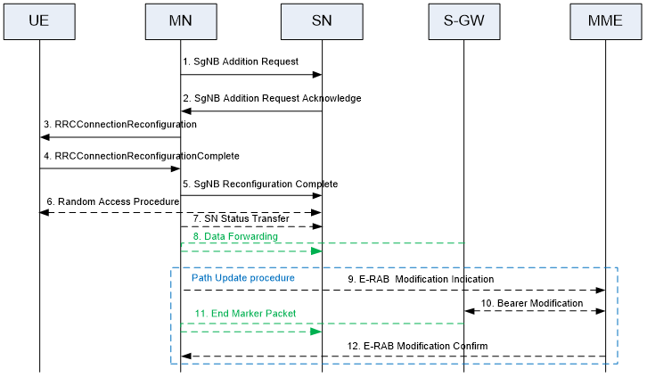
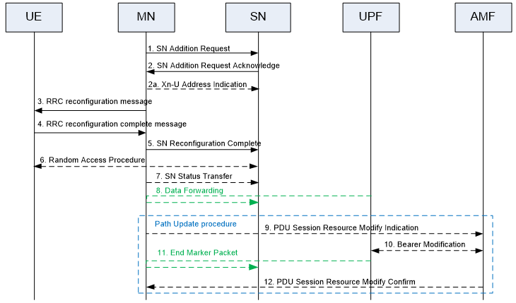
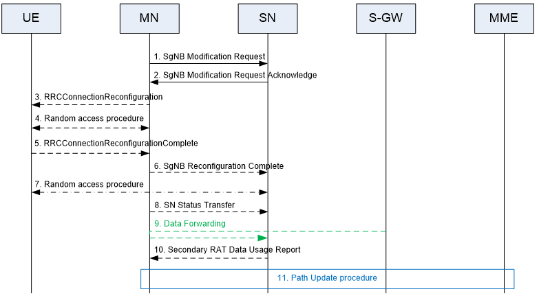
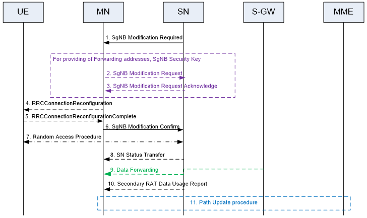
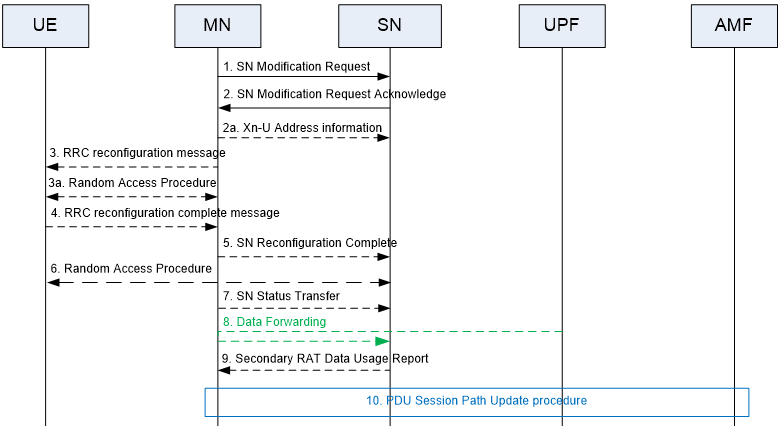
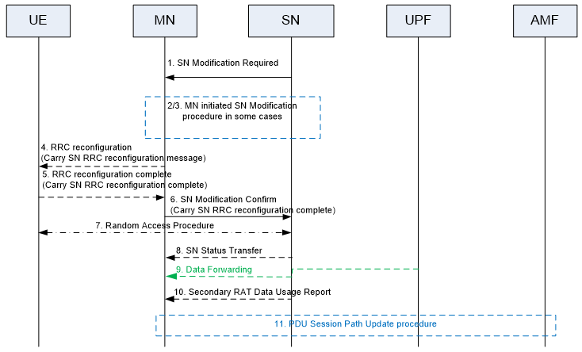

- > Title: E-UTRA and NR; Multi-connectivity; Stage 2
- # 6 Layer 2 related aspects
  collapsed:: true
	- ## 6.1 MAC Sublayer
		- In MR-DC, the UE is configured with two MAC entities: one MAC entity for the MCG and one MAC entity for the SCG. The serving cells other than the PCell can be activated/deactivated by RRC or MAC Control Element. For activation/deactivation by MAC Control Element, the serving cells of the MCG other than the PCell can only be activated/deactivated by the MAC Control Element received on MCG, and the serving cells of the SCG other than PSCell can only be activated/ deactivated by the MAC Control Element received on SCG. The MAC entity applies the bitmap for the associated cells of either MCG or SCG. When the SCG is not deactivated, the PSCell is always activated like the PCell (i.e. deactivation timer is not applied to PSCell). With the exception of PUCCH SCell, one deactivation timer is configured per SCell by RRC.
		- In MR-DC, semi-persistent scheduling (SPS) resources and configured grant (CG) resources can be configured on serving cells in both MCG and SCG.
		- In MR-DC, for 4-step RA type, contention based random access (CBRA) procedure is supported on both PCell and PSCell while contention free random access (CFRA) procedure is supported on all serving cells in both MCG and SCG. For 2-step RA type, CBRA can be supported on the PCell, if the MN is a gNB (i.e. for NE-DC and NR-DC) and on the PSCell, if the SN is a gNB (i.e, for EN-DC, NGEN-DC and NR-DC) while CFRA is only supported on the PCell, if the MN is a gNB (i.e. for NE-DC and NR-DC).
		- In (NG)EN-DC and NR-DC, when [SCG is deactivated]([[SCG (de)activation|SCG (de)activation]]) as described in [clause 7.13](((650aff7c-9a20-4e51-9b1c-8b756efe2d40))), the TA timer associated with SCG continues running, the UE considers the TA is valid as long as TA timer is running. In case of [SCG activation]([[SCG (de)activation|SCG (de)activation]]), the UE can be instructed by the network to perform random access towards PSCell even if the TA timer associated with PSCell is running and RLF and beam failure are not declared. Besides, the UE can be instructed by the network to perform [SCG activation]([[SCG (de)activation|SCG (de)activation]]) without performing random access, if the TA timer associated with PSCell is running and RLM and beam failure detection are configured but RLF or beam failure is not declared. In case of [network-initiated SCG activation]([[SCG (de)activation|SCG (de)activation]]), both CBRA and CFRA on PSCell are supported. For CFRA, the dedicated RACH resources can be provided in the RRC message used to activate SCG.
		- In MR-DC, the BSR configuration, triggering and reporting are independently performed per cell group. For split bearers, the PDCP data is considered in BSR in the cell group(s) configured by RRC.
		- In MR-DC, separate DRX configurations are provided for MCG and SCG. A secondary DRX group can be configured in MR-DC for a cell group that includes cells in different Frequency Ranges as specified in TS 38.331 [4].
		- In MR-DC, PHR is independently configured per cell group. Events in one cell group can trigger power headroom reporting in both MCG and SCG. Power headroom information for one cell group is also included in a PHR transmitted in the other cell group. While the [SCG is deactivated]([[SCG (de)activation|SCG (de)activation]]), PHR for SCG is not reported.
		- In MR-DC, consistent LBT failure recovery procedure as described in clause 5.6.1 in TS 38.300 [3] can be configured for both MAC entities of MCG and/or SCG when operating with shared spectrum channel access.
		- In MR-DC, for power saving purpose, the UE can be configured with DCP to be monitored on the PCell, if the MN is a gNB (i.e. for NE-DC and NR-DC) and/or with DCP to be monitored on the PSCell, if the SN is a gNB (i.e. for EN-DC, NGEN-DC and NR-DC).
		- In MR-DC, the UE may be configured with enhanced intra-UE overlapping resources prioritization on MN, if the MN is a gNB (i.e. for NE-DC and NR-DC) and on SN, if the SN is a gNB (i.e. for EN-DC, NGEN-DC and NR-DC).
- # 7 RRC related aspects
  collapsed:: true
	- ## 7.2 Measurements
	  collapsed:: true
		- If the measurement is configured to the UE in preparation for the Secondary Node Addition procedure described in clause 10.2, the Master node should configure the measurement to the UE.
		- In case of the intra-secondary node mobility described in clause 10.3, the SN should configure the measurement to the UE in coordination with the MN, if required.
		- The Secondary Node Change procedure described in clause 10.5 can be triggered by both the MN (only for inter-frequency secondary node change) and the SN. For secondary node changes triggered by the SN, the RRM measurement configuration is maintained by the SN which also processes the measurement reporting, without providing the measurement results to the MN.
		- Measurements can be configured independently by the MN and by the SN (intra-RAT measurements on serving and non-serving frequencies). The MN indicates the maximum number of frequency layers and measurement identities of intra-frequency and inter-frequency measurement that can be used in the SN to ensure that UE capabilities are not exceeded. In MR-DC, to assist MN to identify the measurement type, the SN indicates to the MN the list of SCG serving frequencies. In NR-DC, to assist SN to identify the measurement type, the MN indicates also to SN the list of MCG serving frequencies. The SN can also request the MN for new maximum values of the number of measurement identities that it can configure, and it is up to the MN whether to accommodate the SN request, based on the capability coordination principles as described in 7.3. If the SN receives from the MN a new value for the maximum number of measurement identities, is SN responsibility to ensure that its configured measurement identities to comply with the new limit.
		- If MN and SN both configure measurements on the same carrier frequency then the configurations need to be consistent (if the network wants to ensure these are considered as a single measurement layer). Each node (MN and SN) can configure independently a threshold for the SpCell quality. In (NG)EN-DC scenario, when the PCell quality is above the threshold configured by the MN, the UE is still required to perform inter-RAT measurements configured by the MN on the SN RAT (while it's not required to perform intra-RAT measurements); when the PSCell quality is above the threshold configured by the SN, the UE is not required to perform measurements configured by the SN. In NR-DC or NE-DC scenario, when the PCell quality is above the threshold configured by the MN, the UE is not required to perform measurements configured by the MN; when the PSCell quality is above the threshold configured by the SN, the UE is not required to perform measurements configured by the SN.
		- NOTE:	The SN cannot renegotiate the number of frequency layers allocated by the MN in this version of the protocol.
		- In MR-DC, both the MN and the SN can configure CGI reporting. The MN can configure CGI reporting for intra-RAT and inter-RAT cells but the SN can only configure CGI reporting of intra-RAT cells. At any point in time, the UE can be configured with at most one CGI reporting configuration. For CGI reporting coordination, the SN sends the CGI measurement request and the embedded CGI reporting configuration to the MN. Optionally, the SN sends the unknown cell information to the MN. If there is no ongoing CGI reporting measurement on UE side, the MN forwards the SN CGI measurement configuration to UE. Otherwise the MN rejects the request by sending X2/Xn reject message. In case the SN indicates the unknown cell information, and the CGI information of the requested cell is already available in the MN, the MN can also reject the request, and sends the CGI information of the requested cell to the SN. The SN cannot configure the CGI measurement using the SRB3.
		- Both MN-configured and SN-configured RRM measurements are supported while the [SCG is deactivated]([[SCG (de)activation|SCG (de)activation]]). The PSCell measurement cycle when in [deactivated SCG state]([[SCG (de)activation|SCG (de)activation]]) is configured by RRC.
		- When SRB3 is not configured or the SCG is deactivated, reports for measurements configured by the SN are sent on SRB1. When SRB3 is configured and SCG transmission of radio bearers is not suspended and the SCG is not deactivated, reports for measurements configured by the SN are sent on SRB3.
		- Measurement results related to the target SN can be provided by MN to target SN at MN initiated SN change procedure. Measurement results of target SN can be forwarded from source SN to target SN via MN at SN initiated SN change procedure. Measurement results related to the target SN can be provided by source MN to target MN at Inter-MN handover with/without SN change procedure.
		- Measurement results according to measurement configuration from the MN are encoded according to SN RRC when they are provided by MN to SN in SgNB Addition Request message / SN Addition Request message. During SN initiated SN change procedure, measurement results according to measurement configuration from SN are encoded according to SN RRC when they are provided by MN to SN in SgNB Addition Request message / SN Addition Request message.
		- Per-UE or per-FR measurement gaps can be configured, depending on UE capability to support independent FR measurement and network preference. Per-UE gap applies to both FR1 (E-UTRA, UTRA-FDD and NR) and FR2 (NR) frequencies. For per-FR gap, two independent gap patterns (i.e. FR1 gap and FR2 gap) are configured for FR1 and FR2 respectively. The UE may also be configured with a per-UE gap sharing configuration (applying to per-UE gap) or with two separate gap sharing configurations (applying to FR1 and FR2 measurement gaps respectively) [8].
		- A measurement gap configuration is always provided:
			- In EN-DC, NGEN-DC and NE-DC, for UEs configured with E-UTRA inter-frequency measurements as described in table 9.1.2-2 in TS 38.133 [8];
			- In EN-DC and NGEN-DC, for UEs configured with UTRAN and GERAN measurements as described in table 9.1.2-2 in TS 38.133 [8];
			- In NR-DC, for UEs configured with E-UTRAN measurements as described in table 9.1.2-3 in TS 38.133 [8];
			- In NR-DC, NE-DC, for UEs configured with UTRAN measurements as described in table 9.4.6.3-1 and 9.4.6.3-2 in TS 38.133 [8];
			- In MR-DC, for UEs that support either per-UE or per-FR gaps, when the conditions to measure SSB based inter-frequency measurement or SSB based intra-frequency measurement as described in clause 9.2.4 in TS 38.300 [3] are met;
		- If per-UE gap is used, the MN decides the gap pattern and the related gap sharing configuration. If per-FR gap is used, in EN-DC and NGEN-DC, the MN decides the FR1 gap pattern and the related gap sharing configuration for FR1, while the SN decides the FR2 gap pattern and the related gap sharing configuration for FR2; in NE-DC and NR-DC, the MN decides both the FR1 and FR2 gap patterns and the related gap sharing configurations.
		- In EN-DC and NGEN-DC, the measurement gap configuration from the MN to the UE indicates if the configuration from the MN is a per-UE gap or an FR1 gap configuration. The MN also indicates the configured per-UE or FR1 measurement gap pattern and the gap purpose (per-UE or per-FR1) to the SN. Measurement gap configuration assistance information can be exchanged between the MN and the SN. For the case of per-UE gap, the SN indicates to the MN the list of SN configured frequencies in FR1 and FR2 measured by the UE. For the per-FR gap case, the SN indicates to the MN the list of SN configured frequencies in FR1 measured by the UE and the MN indicates to the SN the list of MN configured frequencies in FR2 measured by the UE.
		- In NE-DC, the MN indicates the configured per-UE or FR1 measurement gap pattern to the SN. The SN can provide a gap request to the MN, without indicating any list of frequencies.
		- In NR-DC, the MN indicates the configured per-UE, FR1 or FR2 measurement gap pattern and the gap purpose to the SN. The SN can indicate to the MN the list of SN configured frequencies in FR1 and FR2 measured by the UE.
		- In (NG)EN-DC and NR-DC, SMTC can be used for PSCell addition/PSCell change to assist the UE in finding the SSB in the target PSCell. In case the SMTC of the target PSCell is provided by both MN and SN it is up to UE implementation which one to use.
		- CLI measurements can be configured for NR cells in all MR-DC options. In EN-DC and NGEN-DC, only the SN can configure CLI measurements. In NE-DC, only the MN can configure CLI measurements. In NR-DC, both the MN and the SN can configure CLI measurements, and the MN informs the SN about the maximum number of CLI measurement resources that can be configured by the SN to ensure that the total number of CLI measurement resources does not exceed the UE capabilities.
	- ## 7.7 SCG/MCG failure handling
	  collapsed:: true
		- RLF is declared separately for the MCG and for the SCG.
		- If radio link failure is detected for MCG, fast MCG link recovery is configured and the [SCG is not deactivated]([[SCG (de)activation|SCG (de)activation]]), the UE triggers fast MCG link recovery. Otherwise, the UE initiates the RRC connection re-establishment procedure. During the execution of PSCell addition or PSCell change, if radio link failure is detected for MCG, the UE initiates the RRC connection re-establishment procedure.
		- During fast MCG link recovery, the UE suspends MCG transmissions for all radio bearers, except SRB0, and, if any, BH RLC channels and reports the failure with MCGFailureInformation message to the MN via the SCG, using the SCG leg of split SRB1 or SRB3.
		- The UE includes in the MCGFailureInformation message the measurement results available according to current measurement configuration of both the MN and the SN. Once the fast MCG link recovery is triggered, the UE maintains the current measurement configurations from both the MN and the SN, and continues measurements based on configuration from the MN and the SN, if possible. The UE initiates the RRC connection re-establishment procedure if it does not receive an RRCConnectionReconfiguration message, RRCReconfiguration message, MobilityFromNRCommand message, MobilityFromEUTRACommand message, RRCConnectionRelease message or RRCRelease message within a certain time after fast MCG link recovery was initiated.
		- Upon reception of the MCGFailureInformation message, the MN can send RRCConnectionReconfiguration message, RRCReconfiguration message, MobilityFromNRCommand message, MobilityFromEUTRACommand message, RRCConnectionRelease message or RRCRelease message to the UE, using the SCG leg of split SRB1 or SRB3. Upon receiving an RRCConnectionReconfiguration message, RRCReconfiguration message, MobilityFromNRCommand message or MobilityFromEUTRACommand message, the UE resumes MCG transmissions for all radio bearers. Upon receiving an RRCConnectionRelease message or RRCRelease message, the UE releases all the radio bearers and configurations.
		- NOTE 1:	It is up to network implementation to guarantee that the RRC-related messages are delivered to the UE by the SN before the release of its control plane resources.
		- The following SCG failure cases are supported:
			- SCG RLF;
			- SCG beam failure while the [SCG is deactivated]([[SCG (de)activation|SCG (de)activation]]);
			- SN addition/change failure;
			- For EN-DC, NGEN-DC and NR-DC, SCG configuration failure or CPC configuration failure (only for messages on SRB3);
			- For EN-DC, NGEN-DC and NR-DC, SCG RRC integrity check failure (on SRB3);
			- For EN-DC, NGEN-DC and NR-DC, consistent UL LBT failure on PSCell;
			- For IAB-MT, reception of a BH RLF indication from SCG;
			- CPA/CPC execution failure.
		- Upon SCG failure, if MCG transmissions of radio bearers are not suspended, the UE suspends SCG transmissions for all radio bearers and, if any, BH RLC channels, if the SCG failure is not triggered by SCG beam failure, and reports the SCGFailureInformation to the MN, instead of triggering re-establishment. If SCG failure is detected while MCG transmissions for all radio bearers are suspended, the UE initiates the RRC connection re-establishment procedure.
		- SCG/MCG failure handling by UE also applies to IAB MT.
		- In all SCG failure cases, the UE maintains the current measurement configurations from both the MN and the SN and the UE continues measurements based on configuration from the MN and the SN if possible. The SN measurements configured to be routed via the MN will continue to be reported after the SCG failure.
		- NOTE 2:	UE may not continue measurements based on configuration from the SN after SCG failure in certain cases (e.g. UE cannot maintain the timing of PSCell).
		- The UE includes in the SCGFailureInformation message the measurement results available according to current measurement configuration of both the MN and the SN.	The MN handles the SCGFailureInformation message and may decide to keep, change, or release the SN/SCG. In all the cases, the measurement results according to the SN configuration and the SCG failure type may be forwarded to the old SN and/or to the new SN.
		- In case of CPA/CPC, upon transmission of the SCGFailureInformation message to the MN, the UE stops evaluating the CPA/CPC execution condition. The UE is not required to continue measurements for candidate PSCell(s) for execution condition upon transmission of the SCGFailureInformation message to the MN.
	- ## 7.10 UE assistance information
	  collapsed:: true
		- In MR-DC, the UE can be configured to report MCG specific UE assistance information if the MN is a gNB and/or SCG specific UE assistance information if the SN is a gNB, if it prefers an adjustment on the connected mode DRX parameters, the maximum aggregated bandwidth, the maximum number of secondary component carriers, the maximum number of MIMO layers, whether the UE prefers the [SCG to be deactivated]([[SCG (de)activation|SCG (de)activation]]), the minimum scheduling offset for cross-slot scheduling cycle length, and/or whether the UE is applying RLM/BFD measurements relaxation for power saving. In these cases, it is up to the network whether to accommodate the preference or how to use the relaxation status indications. SCG specific UE assistance information for power saving can be configured by the network via SRB1 or SRB3. SCG specific UE assistance information for power saving is directly transmitted to the SN via SRB3, if SRB3 is configured and the [SCG is activated]([[SCG (de)activation|SCG (de)activation]]), otherwise UE transmits SCG specific UE assistance information for power saving in a transparent container to the MN. When network simultaneously configures the UE to perform radio link monitoring on the SCG and beam failure detection on the SCG while the [SCG is deactivated]([[SCG (de)activation|SCG (de)activation]]), UE assistance information for the relaxation state report of RLM/BFD measurements for SCG is reported over MCG. UE can implicitly indicate a preference for NR SCG release by indicating zero number of carriers and zero aggregated maximum bandwidth in both FR1 and FR2.
	- ## 7.13 [Activation and Deactivation of SCG]([[SCG (de)activation|SCG (de)activation]])
	  id:: 650aff7c-9a20-4e51-9b1c-8b756efe2d40
	  collapsed:: true
		- To enable reasonable UE battery consumption while having fast usage of SCG when (NG)EN-DC or NR-DC is configured, an activation/deactivation mechanism of SCG is supported. While the SCG is deactivated, there is no transmission via SCG RLC bearers. Only the NR SCG can be deactivated, and all SCG SCell(s) are in deactivated state while the SCG is deactivated.
		- Upon SCG deactivation and while the SCG is deactivated, the network ensures that there is no uplink control PDU transmission to the deactivated SCG (e.g. the network releases statusReportRequired from PDCP entities of SCG bearers if configured, the network does not perform QoS flow remapping from a DRB associated to the deactivated SCG to another DRB). The network ensures the SCG is activated while PDCP duplication is activated for SCG RLC entities associated with a PDCP entity.
		- NOTE:	Upon SCG (de)activation, it is up to the network to ensure there is no pending SDUs or PDUs in SCG RLC entity (e.g. instructs the UE to perform PDCP data recovery and RLC re-establishment/release, if needed).
		- While the SCG is deactivated, the UE will not transmit PUSCH, SRS and CSI report on SCG, and the UE is not required to monitor PDCCH or receive DL-SCH on SCG. If configured by the network, the UE performs radio link monitoring on the SCG and beam failure detection on the SCG while SCG is deactivated. In case of SCG activation without performing random access, the network can indicate TCI states to UE for PDCCH/PDSCH reception on PSCell, if not provided, the UE uses the previously activated TCI states.
		- The MN can configure the SCG as activated or deactivated upon e.g. PSCell addition, PSCell change, RRC Resume or handover. In case the SCG is configured as deactivated, the UE does not perform random access towards the PSCell. The network can trigger SCG RRC reconfiguration (e.g. PSCell change, configuration update) when deactivating the SCG and while the SCG is in deactivated state.
		- SCG activation can be requested by the MN, by the SN and by the UE. SCG deactivation can be requested by the MN and by the SN. For UL data arrival on SCG bearer(s) while the SCG is deactivated, the UE indicates to the MN that it has UL data to transmit over SCG bearer. During handover procedure, the target MN can indicate the SCG state in the RRC reconfiguration message sent to the UE by the source MN.
		- Network can configure whether the UE is allowed to indicate a preference for SCG deactivation to the MN.
	- ## 7.14 RLM/BFD relaxation
	  collapsed:: true
		- For RLM and BFD relaxation, network may configure low mobility criterion in the NR PCell for the case of NE-DC/NR-DC, and in the NR PSCell for the case of EN-DC and NGEN-DC. MN informs SN when low mobility criterion has been configured in the NR PCell for NR-DC.
		- For RLM relaxation, network may configure good serving cell criterion in the NR PCell for the case of NE-DC/NR-DC, and in the NR PSCell for the case of EN-DC, NGEN-DC and NR-DC.
		- For BFD relaxation, network may configure good serving cell criterion in the NR PCell and/or SCell(s) for the case of NE-DC/NR-DC, and in the NR PSCell and/or SCell(s) for the case of EN-DC, NGEN-DC and NR-DC.
		- For RLM/BFD relaxation, network may simultaneously configure the UE to perform radio link monitoring on the SCG and beam failure detection on the SCG while [SCG is deactivated]([[SCG (de)activation|SCG (de)activation]]). In such case, UE initiates UE assistance information for the relaxation state report of RLM/BFD measurements for SCG.
		- For RLM/BFD relaxation, network may simultaneously configure the UE not to perform radio link monitoring on the SCG and beam failure detection on the SCG while [SCG is deactivated]([[SCG (de)activation|SCG (de)activation]]). In such case, UE assistance information for the relaxation state report of RLM/BFD measurements for SCG will not be initiated.
- # 9 Security related aspects
  collapsed:: true
	- MR-DC can only be configured after security activation in the MN.
	- In EN-DC and NGEN-DC, for bearers terminated in the MN the network configures the UE with KeNB; for bearers terminated in the SN the network configures the UE with S-KgNB. In NE-DC, for bearers terminated in the MN the network configures the UE with KgNB; for bearers terminated in the SN the network configures the UE with S-KeNB. In NR-DC, for bearers terminated in the MN the network configures the UE with KgNB; for bearers terminated in the SN the network configures the UE with S-KgNB.
	- In NE-DC and NR-DC, a PCell change without KgNB change does not require a S-KeNB change (NE-DC case) or a S-KgNB change (NR-DC case).
	- In EN-DC, NGEN-DC and NR-DC, for a PSCell change that does not require a KeNB change (i.e. no simultaneous PCell handover in EN-DC and NGEN-DC) or a KgNB change (in NR-DC), S-KgNB key refresh is not required if the PDCP termination point of the SN is not changed. In NE-DC, a PSCell change always requires a S-KeNB change.
	- In EN-DC, the UE supports the NR security algorithms corresponding to the E-UTRA security algorithms signalled at NAS level and the UE NR AS Security capability is not signalled to the MN over RRC. Mapping from E-UTRA security algorithms to the corresponding NR security algorithms, where necessary, is performed at the MN. The MN sends the complete UE security capabilities including all security capability bits previously received (after mapping, where necessary) to the SN.
	- An EN-DC capable UE supporting user plane integrity protection when connected to E-UTRA/EPC (see TS 24.301 [22]) shall support integrity protection for all DRBs (MN and SN terminated) at any data rate, up to and including the highest data rate supported by the UE for both UL and DL. MN and/or SN terminated DRBs can have UP integrity protection activation either on or off, on a per radio bearer basis.
	- For MR-DC with 5GC, UP integrity protection can be configured on a per radio bearer basis. All DRBs which belong to the same PDU session always have the same UP integrity protection activation, i.e., either on or off:
		- For NR-DC: MN and/or SN terminated DRBs of a PDU session can have UP integrity protection activation either on or off. A UE configured to operate in NR-DC shall support integrity protection for all DRBs (MN and SN terminated) at any data rate, up to and including the highest data rate supported by the UE for both UL and DL (see TS 38.300 [3]).
		- For NE-DC: MN terminated DRBs of a PDU session can have UP integrity protection activation on; however, in this case, the MN will not at any point offload any DRB of such PDU session to the SN. A UE configured to operate in NE-DC shall support integrity protection for all MN terminated DRBs at any data rate, up to and including the highest data rate supported by the UE's radio access capabilities for both UL and DL (see TS 38.300 [3]). SN terminated DRBs of a PDU session always have UP integrity protection activation off.
		- For NGEN-DC: Both MN terminated and SN terminated DRBs of a PDU session always have UP integrity protection activation off.
	- In MR-DC with 5GC, the MN sends the complete UE security capabilities to the SN including all NR and E-UTRA security capability bits previously received by the MN from the Core Network or from another NG-RAN node as specified in TS 38.300 [3].
	- In (NG)EN-DC and NR-DC, if the [SCG is deactivated]([[SCG (de)activation|SCG (de)activation]]) as described in clause 7.13, whether to perform security key update upon [SCG activation]([[SCG (de)activation|SCG (de)activation]]) is up to network implementation.
- # 10 Multi-Connectivity operation related aspects
	- ## 10.1 General
	  collapsed:: true
		- Similar procedures as defined under clause 10.1.2.8 (Dual Connectivity operation) in TS 36.300 [2] apply for MR-DC.
		- Similar CHO principles as defined in TS 36.300 [2] and TS 38.300 [3] apply for the Conditional PSCell Change and Conditional PSCell Addition in MR-DC.
		- Conditional PSCell Change and conditional PSCell addition are not supported for the MR-DC options NE-DC and NGEN-DC.
		- Configuration of a [deactivated SCG]([[SCG (de)activation|SCG (de)activation]]) in a conditional configuration, configuration of CPC while the [SCG is deactivated]([[SCG (de)activation|SCG (de)activation]]) and [SCG deactivation]([[SCG (de)activation|SCG (de)activation]]) while CPC is configured are not supported.
		- In MR-DC, CHO is supported in Master Node to eNB/gNB Change procedure and Conditional Handover with Secondary Node procedure.
	- ## 10.2 Secondary Node Addition
		- ### 10.2.1 EN-DC
		  collapsed:: true
			- The Secondary Node Addition procedure is initiated by the MN and is used to establish a UE context at the SN to provide resources from the SN to the UE. For bearers requiring SCG radio resources, this procedure is used to add at least the first cell of the SCG. This procedure can also be used to configure an SN terminated MCG bearer (where no SCG configuration is needed). In case of CPA, the Conditional Secondary Node Addition procedure can be used for CPA configuration and CPA execution.
			- #### Secondary Node Addition
				- Figure 10.2.1-1 shows the Secondary Node Addition procedure.
				- Figure 10.2.1-1: Secondary Node Addition procedure
				  
				- 1.	The MN decides to request the SN to allocate resources for a specific E-RAB, indicating E-RAB characteristics (E-RAB parameters, TNL address information corresponding to bearer type). In addition, for bearers requiring SCG radio resources, MN indicates the requested SCG configuration information, including the entire UE capabilities and the UE capability coordination result. In this case, the MN also provides the latest measurement results for SN to choose and configure the SCG cell(s). The MN may request the SN to allocate radio resources for split SRB operation. The MN always provides all the needed security information to the SN (even if no SN terminated bearers are setup) to enable SRB3 to be setup based on SN decision. In case of bearer options that require X2-U resources between the MN and the SN, the MN provides X2-U TNL address information for the respective E-RAB, X2-U DL TNL address information for SN terminated bearers, X2-U UL TNL address information for MN terminated bearers. In case of SN terminated split bearers the MN provides the maximum QoS level that it can support. The MN may request the [SCG to be activated or deactivated]([[SCG (de)activation|SCG (de)activation]]). The SN may reject the addition request.
				- NOTE 1:	For split bearers, MCG and SCG resources may be requested of such an amount, that the QoS for the respective E-RAB is guaranteed by the exact sum of resources provided by the MCG and the SCG together, or even more. For MN terminated split bearers, the MNs decision is reflected in step 1 by the E-RAB parameters signalled to the SN, which may differ from E-RAB parameters received over S1.
				- NOTE 2:	For a specific E-RAB, the MN may request the direct establishment of an SCG or a split bearer, i.e., without first having to establish an MCG bearer. It is also allowed that all E-RABs can be configured as SN terminated bearers, i.e. there is no E-RAB established as an MN terminated bearer.
				- 2.	If the RRM entity in the SN is able to admit the resource request, it allocates respective radio resources and, dependent on the bearer option, respective transport network resources. For bearers requiring SCG radio resources, the SN triggers Random Access so that synchronisation of the SN radio resource configuration can be performed. The SN decides the PSCell and other SCG SCells and provides the new SCG radio resource configuration to the MN in a NR RRC configuration message contained in the SgNB Addition Request Acknowledge message. In case of bearer options that require X2-U resources between the MN and the SN, the SN provides X2-U TNL address information for the respective E-RAB, X2-U UL TNL address information for SN terminated bearers, X2-U DL TNL address information for MN terminated bearers. For SN terminated bearers, the SN provides the S1-U DL TNL address information for the respective E-RAB and security algorithm. If SCG radio resources have been requested, the SCG radio resource configuration is provided. If the MN requested the [SCG to be deactivated]([[SCG (de)activation|SCG (de)activation]]), the SN may keep the [SCG activated]([[SCG (de)activation|SCG (de)activation]]). If the MN requests the [SCG to be activated]([[SCG (de)activation|SCG (de)activation]]), the SN shall keep the [SCG activated]([[SCG (de)activation|SCG (de)activation]]).
				- NOTE 3:	For the SN terminated split bearer option, the SN may either decide to request resources from the MN of such an amount, that the QoS for the respective E-RAB is guaranteed by the exact sum of resources provided by the MN and the SN together, or even more. The SNs decision is reflected in step 2 by the E-RAB parameters signalled to the MN, which may differ from E-RAB parameters received in step 1. The QoS level requested from the MN shall not exceed the level that the MN offered when setting up the split bearer in step 1.
				- NOTE 4:	In case of MN terminated bearers, transmission of user plane data may take place after step 2.
				- NOTE 5:	In case of SN terminated bearers, data forwarding and the SN Status Transfer may take place after step 2.
				- 3.	The MN sends to the UE the RRCConnectionReconfiguration message including the NR RRC configuration message, without modifying it. Within the MN RRCConnectionReconfiguration message, the MN can indicate the [SCG is deactivated]([[SCG (de)activation|SCG (de)activation]]).
				- 4.	The UE applies the new configuration and replies to MN with RRCConnectionReconfigurationComplete message, including a NR RRC response message, if needed. In case the UE is unable to comply with (part of) the configuration included in the RRCConnectionReconfiguration message, it performs the reconfiguration failure procedure.
				- 5.	The MN informs the SN that the UE has completed the reconfiguration procedure successfully via SgNB ReconfigurationComplete message, including the encoded NR RRC response message, if received from the UE.
				- 6.	If configured with bearers requiring SCG radio resources and the [SCG is not deactivated]([[SCG (de)activation|SCG (de)activation]]), the UE performs synchronisation towards the PSCell of the SN. The order the UE sends the RRCConnectionReconfigurationComplete message and performs the Random Access procedure towards the SCG is not defined. The successful RA procedure towards the SCG is not required for a successful completion of the RRC Connection Reconfiguration procedure.
				- 7.	If PDCP termination point is changed to the SN for bearers using RLC AM, and when RRC full configuration is not used, the MN sends the SN Status Transfer message.
				- 8.	For SN terminated bearers moved from the MN, dependent on the bearer characteristics of the respective E-RAB, the MN may take actions to minimise service interruption due to activation of EN-DC (Data forwarding).
				- 9-12.	If applicable, the update of the UP path towards the EPC is performed.
			- #### Conditional Secondary Node Addition
				- TODO TBU
		- ### 10.2.2 MR-DC with 5GC
		  collapsed:: true
			- The Secondary Node (SN) Addition procedure is initiated by the MN and is used to establish a UE context at the SN in order to provide resources from the SN to the UE. For bearers requiring SCG radio resources, this procedure is used to add at least the initial SCG serving cell of the SCG. This procedure can also be used to configure an SN terminated MCG bearer (where no SCG configuration is needed). In case of CPA, the Conditional Secondary Node Addition procedure can be used for CPA configuration and CPA execution.
			- #### Secondary Node Addition
				- Figure 10.2.2-1 shows the SN Addition procedure.
				- Figure 10.2.2-1: SN Addition procedure
				  
				- 1.	The MN decides to request the target SN to allocate resources for one or more specific PDU Sessions/QoS Flows, indicating QoS Flows characteristics (QoS Flow Level QoS parameters, PDU session level TNL address information, and PDU session level Network Slice info). In addition, for bearers requiring SCG radio resources, MN indicates the requested SCG configuration information, including the entire UE capabilities and the UE capability coordination result. In this case, the MN also provides the latest measurement results for SN to choose and configure the SCG cell(s). The MN may request the SN to allocate radio resources for split SRB operation. In NGEN-DC and NR-DC, the MN always provides all the needed security information to the SN (even if no SN terminated bearers are setup) to enable SRB3 to be setup based on SN decision. The MN may request the [SCG to be activated or deactivated]([[SCG (de)activation|SCG (de)activation]]).
				  	For MN terminated bearer options that require Xn-U resources between the MN and the SN, the MN provides Xn-U UL TNL address information. For SN terminated bearers, the MN provides a list of available DRB IDs. The S-NG-RAN node shall store this information and use it when establishing SN terminated bearers. The SN may reject the request.
				  	For SN terminated bearer options that require Xn-U resources between the MN and the SN, the MN provides in step 1 a list of QoS flows per PDU Sessions for which SCG resources are requested to be setup upon which the SN decides how to map QoS flows to DRB.
				- NOTE 1:	For split bearers, MCG and SCG resources may be requested of such an amount, that the QoS for the respective QoS Flow is guaranteed by the exact sum of resources provided by the MCG and the SCG together, or even more. For MN terminated split bearers, the MN decision is reflected in step 1 by the QoS Flow parameters signalled to the SN, which may differ from QoS Flow parameters received over NG.
				- NOTE 2:	For a specific QoS flow, the MN may request the direct establishment of SCG and/or split bearers, i.e. without first having to establish MCG bearers. It is also allowed that all QoS flows can be mapped to SN terminated bearers, i.e. there is no QoS flow mapped to an MN terminated bearer.
				- 2.	If the RRM entity in the SN is able to admit the resource request, it allocates respective radio resources and, dependent on the bearer type options, respective transport network resources. For bearers requiring SCG radio resources the SN triggers UE Random Access so that synchronisation of the SN radio resource configuration can be performed. The SN decides for the PSCell and other SCG SCells and provides the new SCG radio resource configuration to the MN within an SN RRC configuration message contained in the SN Addition Request Acknowledge message. If the MN requested the [SCG to be deactivated]([[SCG (de)activation|SCG (de)activation]]), the SN may keep the [SCG activated]([[SCG (de)activation|SCG (de)activation]]). If the MN requests the [SCG to be activated]([[SCG (de)activation|SCG (de)activation]]), the SN shall keep the [SCG activated]([[SCG (de)activation|SCG (de)activation]]). In case of bearer options that require Xn-U resources between the MN and the SN, the SN provides Xn-U TNL address information for the respective DRB, Xn-U UL TNL address information for SN terminated bearers, Xn-U DL TNL address information for MN terminated bearers. For SN terminated bearers, the SN provides the NG-U DL TNL address information for the respective PDU Session and security algorithm. If SCG radio resources have been requested, the SCG radio resource configuration is provided.
				- NOTE 3:	In case of MN terminated bearers, transmission of user plane data may take place after step 2.
				- NOTE 4:	In case of SN terminated bearers, data forwarding and the SN Status Transfer may take place after step 2.
				- NOTE 5:	For MN terminated bearers for which PDCP duplication with CA is configured in NR SCG side, the MN allocates up to 4 separate Xn-U bearers and the SN provides a logical channel ID for primary or split secondary path to the MN.
				  	For SN terminated bearers for which PDCP duplication with CA is configured in NR MCG side, the SN allocates up to 4 separate Xn-U bearers and the MN provides a logical channel ID for primary or split secondary path to the SN via an additional MN-initiated SN modification procedure.
				- 2a.	For SN terminated bearers using MCG resources, the MN provides Xn-U DL TNL address information in the Xn-U Address Indication message.
				- 3.	The MN sends the MN RRC reconfiguration message to the UE including the SN RRC configuration message, without modifying it. Within the MN RRC reconfiguration message, the MN can indicate the [SCG is deactivated]([[SCG (de)activation|SCG (de)activation]]).
				- 4.	The UE applies the new configuration and replies to MN with MN RRC reconfiguration complete message, including an SN RRC response message for SN, if needed. In case the UE is unable to comply with (part of) the configuration included in the MN RRC reconfiguration message, it performs the reconfiguration failure procedure.
				- 5.	The MN informs the SN that the UE has completed the reconfiguration procedure successfully via SN Reconfiguration Complete message, including the SN RRC response message, if received from the UE.
				- 6.	If configured with bearers requiring SCG radio resources and the [SCG is not deactivated]([[SCG (de)activation|SCG (de)activation]]), the UE performs synchronisation towards the PSCell configured by the SN. The order the UE sends the MN RRC reconfiguration complete message and performs the Random Access procedure towards the SCG is not defined. The successful RA procedure towards the SCG is not required for a successful completion of the RRC Connection Reconfiguration procedure.
				- 7.	If PDCP termination point is changed to the SN for bearers using RLC AM, and when RRC full configuration is not used, the MN sends the SN Status Transfer message.
				  8.	For SN terminated bearers or QoS flows moved from the MN, dependent on the characteristics of the respective bearer or QoS flow, the MN may take actions to minimise service interruption due to activation of MR-DC (Data forwarding).
				- 9-12.	If applicable, the update of the UP path towards the 5GC is performed via a PDU Session Path Update procedure.
			- #### Conditional Secondary Node Addition
				- TODO TBU
	- ## 10.3 Secondary Node Modification (MN/SN initiated)
		- ### 10.3.1 EN-DC
		  collapsed:: true
			- The Secondary Node Modification procedure may be initiated either by the MN or by the SN and be used to modify, establish or release bearer contexts, to transfer bearer contexts to and from the SN or to modify other properties of the UE context within the same SN. It may also be used to transfer an NR RRC message from the SN to the UE via the MN and the response from the UE via MN to the SN (e.g. when SRB3 is not used). In case of CPA or inter-SN CPC, this procedure is used to modify CPA or inter-SN CPC configuration within the same candidate SN. In case of CPA or inter-SN CPC, this procedure may also be triggered by the candidate SN to add some prepared PSCells from the suggested list or cancel part of the prepared PSCells. In case of intra-SN CPC, this procedure is used to configure, modify or release intra-SN CPC configuration. This procedure may be initiated by the MN or SN to request the SN or MN to [deactivate or activate the SCG]([[SCG (de)activation|SCG (de)activation]]).
			- The Secondary Node modification procedure does not necessarily need to involve signalling towards the UE.
			- #### MN initiated SN Modification
			  collapsed:: true
				- Figure 10.3.1-1: SN Modification procedure - MN initiated
				  
				- The MN uses the procedure to initiate configuration changes of the SCG within the same SN, e.g. the addition, modification or release of SCG bearer(s) and the SCG RLC bearer of split bearer(s), as well as configuration changes for SN terminated MCG bearers. Bearer termination point change is realized by adding the new bearer configuration and releasing the old bearer configuration within a single MN initiated SN Modification procedure for the respective E-RAB. The MN uses this procedure to perform handover within the same MN while keeping the SN. The MN also uses the procedure to query the current SCG configuration, e.g. when delta configuration is applied in an MN initiated SN change. The MN also uses the procedure to provide the S-RLF related information to the SN. The MN also uses this procedure to [activate or deactivate the SCG]([[SCG (de)activation|SCG (de)activation]]). The MN may not use the procedure to initiate the addition, modification or release of SCG SCells. The SN may reject the request, except if it concerns the release of SN terminated bearer(s) or the SCG RLC bearer of MN terminated bearer(s), or if it is used to perform handover within the same MN while keeping the SN. Figure 10.3.1-1 shows an example signalling flow for an MN initiated SN Modification procedure.
				- 1.	The MN sends the SgNB Modification Request message, which may contain bearer context related or other UE context related information, data forwarding address information (if applicable) and the requested SCG configuration information, including the UE capability coordination result to be used as basis for the reconfiguration by the SN. The MN may request the [SCG to be activated or deactivated]([[SCG (de)activation|SCG (de)activation]]). In case a security key update in the SN is required, a new SgNB Security Key is included. In case of SCG RLC re-establishment for E-RABs configured with an MN terminated bearer with an SCG RLC bearer for which no bearer type change is performed, the MN provides a new UL GTP tunnel endpoint to the SN. The SN shall continue sending UL PDCP PDUs to the MN with the previous UL GTP tunnel endpoint until it re-establishes the RLC and use the new UL GTP tunnel endpoint after re-establishment. In case of PDCP re-establishment for E-RABs configured with an SN terminated bearer with an MCG RLC bearer for which no bearer type change is performed, the MN provides a new DL GTP tunnel endpoint to the SN. The SN shall continue sending DL PDCP PDUs to the MN with the previous DL GTP tunnel endpoint until it performs PDCP re-establishment and use the new DL GTP tunnel endpoint starting with the PDCP re-establishment.
				- 2.	The SN responds with the SgNB Modification Request Acknowledge message, which may contain SCG radio resource configuration information within a NR RRC configuration message and data forwarding address information (if applicable). If the MN requested the [SCG to be activated or deactivated]([[SCG (de)activation|SCG (de)activation]]), the SN indicates whether the [SCG is activated or deactivated]([[SCG (de)activation|SCG (de)activation]]). In case of a security key update (with or without PSCell change), for E-RABs configured with the MN terminated bearer option that require X2-U resources between the MN and the SN, for which no bearer type change is performed, the SN provides a new DL GTP tunnel endpoint to the MN. The MN shall continue sending DL PDCP PDUs to the SN with the previous DL GTP tunnel endpoint until it performs PDCP re-establishment or PDCP data recovery, and use the new DL GTP tunnel endpoint starting with the PDCP re-establishment or data recovery. In case of a security key update (with or without PSCell change), for E-RABs configured with the SN terminated bearer option that require X2-U resources between the MN and the SN, for which no bearer type change is performed, the SN provides a new UL GTP tunnel endpoint to the MN. The MN shall continue sending UL PDCP PDUs to the SN with the previous UL GTP tunnel endpoint until it re-establishes the RLC and use the new UL GTP tunnel endpoint after re-establishment.
				- NOTE 00:	In case SN includes the indication of full RRC configuration in SgNB Modification Request Acknowledge message to MN e.g. comprehension failure upon intra-CU inter-DU change, MN performs release and add of the NR SCG part of the configuration but does not release SN terminated radio bearers towards the UE.
				- 3-5.	The MN initiates the RRC connection reconfiguration procedure, including the NR RRC configuration message. The UE applies the new configuration, synchronizes to the MN (if instructed, in case of intra-MN handover) and replies with RRCConnectionReconfigurationComplete, including a NR RRC response message, if needed. In case the UE is unable to comply with (part of) the configuration included in the RRCConnectionReconfiguration message, it performs the reconfiguration failure procedure.
				- 6.	Upon successful completion of the reconfiguration, the success of the procedure is indicated in the SgNB Reconfiguration Complete message.
				- 7.	If instructed, the UE performs synchronisation towards the PSCell of the SN as described in SgNB addition procedure. Otherwise, the UE may perform UL transmission after having applied the new configuration.
				- 8.	If PDCP termination point is changed for bearers using RLC AM, and when RRC full configuration is not used, the SN Status Transfer takes place between the MN and the SN (Figure 10.3.1-1 depicts the case where a bearer context is transferred from the MN to the SN).
				- NOTE 0:	The SN may not be aware that a SN terminated bearer requested to be released is reconfigured to a MN terminated bearer. The SN Status for the released SN terminated bearers with RLC AM may also be transferred to the MN.
				- 9.	If applicable, data forwarding between MN and the SN takes place (Figure 10.3.1-1 depicts the case where a bearer context is transferred from the MN to the SN).
				- 10.	The SN sends the Secondary RAT Data Usage Report message to the MN and includes the data volumes delivered to and received from the UE over the NR radio for the E-RABs to be released and for the E-RABs for which the S1 UL GTP Tunnel endpoint was requested to be modified.
				- NOTE 1:	The order the SN sends the Secondary RAT Data Usage Report message and performs data forwarding with MN is not defined. The SN may send the report when the transmission of the related bearer is stopped.
				- 11.	If applicable, a path update is performed.
			- #### SN initiated SN Modification with MN involvement
			  collapsed:: true
				- Figure 10.3.1-2: SN Modification procedure - SN initiated with MN involvement
				  
				- The SN uses the procedure to perform configuration changes of the SCG within the same SN, e.g. to trigger the release of SCG bearer(s) and the SCG RLC bearer of split bearer(s) (upon which the MN may release the bearer or maintain current bearer type or reconfigure it to an MCG bearer, either MN terminated or SN terminated), to trigger the release of SCG resources (e.g., release SCG lower layer resources but keep SN), and to trigger PSCell change (e.g. when a new security key is required or when the MN needs to perform PDCP data recovery). The MN cannot reject the release request of SCG bearer and the SCG RLC bearer of a split bearer and the release request of SCG resources. The SN also uses this procedure to [activate or deactivate the SCG]([[SCG (de)activation|SCG (de)activation]]). The MN shall either accept modification of all of the requested SCG bearer(s) and the SCG RLC bearer of split bearer(s) and the request of [activation or deactivation of the SCG]([[SCG (de)activation|SCG (de)activation]]), or fail the procedure. Figure 10.3.1-2 shows an example signalling flow for an SN initiated SgNB Modification procedure, with MN involvement.
				- 1.	The SN sends the SgNB Modification Required message including a NR RRC configuration message, which may contain bearer context related, other UE context related information and the new SCG radio resource configuration. The SN may request the [SCG to be activated or deactivated]([[SCG (de)activation|SCG (de)activation]]). For bearer release or modification, a corresponding E-RAB list is included in the SgNB Modification Required message. In case of change of security key, the PDCP Change Indication indicates that a S-KgNB update is required. In case the MN needs to perform PDCP data recovery, the PDCP Change Indication indicates that PDCP data recovery is required. In case SN decides to trigger SCG release, the E-RABs to be modified list includes all the E-RABs of the UE with SCG resource indicated as not present for each E-RAB.
				  The SN can decide whether the change of security key is required.
				- NOTE 1a:	In case SN includes the indication of full RRC configuration in SgNB Modification Required message to MN e.g. comprehension failure upon intra-CU inter-DU change, MN performs release and add of the NR SCG part of the configuration but does not release SN terminated radio bearers towards the UE.
				- NOTE 1b:	In case that a MN initiated conditional reconfiguration (e.g. CHO or MN initiated inter-SN CPC) is prepared, and if any execution of a prepared SN initiated intra-SN CPC procedure or reconfiguration of the SCG, the SN notifies to the MN via the SgNB Modification Required message. In this case, the steps 2 and 3 are skipped.
				- NOTE 1c:	In case of SN initiated inter-SN CPC and in case that a candidate SN triggered the SN Initiated SN Modification procedure to include some more prepared PSCells (within the candidate cells suggested by the source SN in SN initiated inter-SN CPC) or to remove some prepared PSCells, the MN may decide to trigger the step 2 towards the source SN.
				- 2/3.	The MN initiated SN Modification procedure may be triggered by the SN Modification Required message (e.g. to provide information such as data forwarding addresses, new SN security key, measurement gap, etc...)
				- NOTE 2:	If only SN security key is provided in step 2, the MN does not need to wait for the reception of step 3 to initiate the RRC connection reconfiguration procedure.
				- 4.	The MN sends the RRCConnectionReconfiguration message including a NR RRC configuration message to the UE including the new SCG radio resource configuration.
				- 5.	The UE applies the new configuration and sends the RRCConnectionReconfigurationComplete message, including an encoded NR RRC response message, if needed. In case the UE is unable to comply with (part of) the configuration included in the RRCConnectionReconfiguration message, it performs the reconfiguration failure procedure.
				- 6.	Upon successful completion of the reconfiguration, the success of the procedure is indicated in the SgNB Modification Confirm message containing the encoded NR RRC response message, if received from the UE.
				- 7.	If instructed, the UE performs synchronisation towards the PSCell of the SN as described in SN addition procedure. Otherwise, the UE may perform UL transmission after having applied the new configuration.
				- 8.	If PDCP termination point is changed for bearers using RLC AM, and when RRC full configuration is not used, the SN Status Transfer takes place between the MN and the SN (Figure 10.3.1-2 depicts the case where a bearer context is transferred from the SN to the MN).
				- NOTE 2a:	The SN may not be aware that a SN terminated bearer requesting to release is reconfigured to a MN terminated bearer. The SN Status for the released SN terminated bearers with RLC AM may also be transferred to the MN.
				- 9.	If applicable, data forwarding between MN and the SN takes place (Figure 10.3.1-2 depicts the case where a bearer context is transferred from the SN to the MN).
				- 10.	The SN sends the Secondary RAT Data Usage Report message to the MN and includes the data volumes delivered to and received from the UE over the NR radio for the E-RABs to be released.
				- NOTE 3:	The order the SN sends the Secondary RAT Data Usage Report message and performs data forwarding with MN is not defined. The SN may send the report when the transmission of the related bearer is stopped.
				- 11.	If applicable, a path update is performed.
			- #### SN initiated SN Modification without MN involvement
				- TODO TBU
			- #### SN initiated Conditional SN Modification without MN involvement (SRB3 is used)
				- TODO TBU
			- #### Transfer of an NR RRC message to/from the UE (when SRB3 is not used)
				- TODO TBU
			- #### SN initiated Conditional SN Modification without MN involvement (SRB3 is not used)
				- TODO TBU
		- ### 10.3.2 MR-DC with 5GC
		  collapsed:: true
			- The SN Modification procedure may be initiated either by the MN or by the SN and be used to modify the current user plane resource configuration (e.g. related to PDU session, QoS flow or DRB) or to modify other properties of the UE context within the same SN. It may also be used to transfer an RRC message from the SN to the UE via the MN and the response from the UE via MN to the SN (e.g. when SRB3 is not used). In NGEN-DC and NR-DC, the RRC message is an NR message (i.e., RRCReconfiguration) whereas in NE-DC it is an E-UTRA message (i.e., RRCConnectionReconfiguration). In case of CPA or inter-SN CPC, this procedure is used to modify CPA or inter-SN CPC configuration within the same candidate SN. In case of CPA or inter-SN CPC, this procedure may also be triggered by the candidate SN to add some prepared PSCells from the suggested list or cancel part of the prepared PSCells. In case of intra-SN CPC, this procedure is used to configure, modify or release intra-SN CPC configuration. This procedure may be initiated by the MN or SN to request the SN or MN to [activate or deactivate the SCG]([[SCG (de)activation|SCG (de)activation]]).
			- The SN modification procedure does not necessarily need to involve signalling towards the UE.
			- #### MN initiated SN Modification
				- Figure 10.3.2-1: SN Modification procedure - MN initiated
				  
				- The MN uses the procedure to initiate configuration changes of the SCG within the same SN, including addition, modification or release of the user plane resource configuration. The MN uses this procedure to perform handover within the same MN while keeping the SN, when the SN needs to be involved (i.e. in NGEN-DC). The MN also uses the procedure to query the current SCG configuration, e.g. when delta configuration is applied in an MN initiated SN change. The MN also uses the procedure to provide the S-RLF related information to the SN or to provide additional available DRB IDs to be used for SN terminated bearers. The MN also uses this procedure to [activate or deactivate the SCG]([[SCG (de)activation|SCG (de)activation]]). The MN may not use the procedure to initiate the addition, modification or release of SCG SCells. The SN may reject the request, except if it concerns the release of the user plane resource configuration, or if it is used to perform handover within the same MN while keeping the SN. Figure 10.3.2-1 shows an example signalling flow for an MN initiated SN Modification procedure.
				- 1.	The MN sends the SN Modification Request message, which may contain user plane resource configuration related or other UE context related information, PDU session level Network Slice info and the requested SCG configuration information, including the UE capabilities coordination result to be used as basis for the reconfiguration by the SN. In case a security key update in the SN is required, a new SN Security Key is included. In case the PDCP data recovery in the SN is required, the PDCP Change Indication is included which indicates that PDCP data recovery is required in SN.
				- 2.	The SN responds with the SN Modification Request Acknowledge message, which may contain new SCG radio configuration information within an SN RRC reconfiguration message, and data forwarding address information (if applicable). If the MN requested the [SCG to be activated or deactivated]([[SCG (de)activation|SCG (de)activation]]), the SN indicates whether the [SCG is activated or deactivated]([[SCG (de)activation|SCG (de)activation]]).
				- NOTE 1:	For MN terminated bearers to be setup for which PDCP duplication with CA is configured in NR SCG side, the MN allocates up to 4 separate Xn-U bearers and the SN provides a logical channel ID for primary or split secondary path to the MN.
				  	For SN terminated bearers to be setup for which PDCP duplication with CA is configured in NR MCG side, the SN allocates up to 4 separate Xn-U bearers and the MN provides a logical channel ID for primary or split secondary path to the SN via an additional MN-initiated SN modification procedure.
				- 2a.	When applicable, the MN provides data forwarding address information to the SN. For SN terminated bearers using MCG resources, the MN provides Xn-U DL TNL address information in the Xn-U Address Indication message.
				- 3/4.	The MN initiates the RRC reconfiguration procedure, including an SN RRC reconfiguration message. The UE applies the new configuration, synchronizes to the MN (if instructed, in case of intra-MN handover) and replies with MN RRC reconfiguration complete message, including an SN RRC response message, if needed. In case the UE is unable to comply with (part of) the configuration included in the MN RRC reconfiguration message, it performs the reconfiguration failure procedure.
				- 5.	Upon successful completion of the reconfiguration, the success of the procedure is indicated in the SN Reconfiguration Complete message.
				- 6.	If instructed, the UE performs synchronisation towards the PSCell of the SN as described in SN addition procedure. Otherwise, the UE may perform UL transmission after having applied the new configuration.
				- 7.	If PDCP termination point is changed for bearers using RLC AM, and when RRC full configuration is not used, the SN Status Transfer takes place between the MN and the SN (Figure 10.3.2-1 depicts the case where a bearer context is transferred from the MN to the SN).
				- 8.	If applicable, data forwarding between MN and the SN takes place (Figure 10.3.2-1 depicts the case where a user plane resource configuration related context is transferred from the MN to the SN).
				- 9.	The SN sends the Secondary RAT Data Usage Report message to the MN and includes the data volumes delivered to and received from the UE as described in clause 10.11.2.
				- NOTE 2:	The order the SN sends the Secondary RAT Data Usage Report message and performs data forwarding with MN is not defined. The SN may send the report when the transmission of the related QoS flow is stopped.
				- 10.	If applicable, a PDU Session path update procedure is performed.
			- #### SN initiated SN Modification with MN involvement
				- Figure 10.3.2-2: SN Modification procedure - SN initiated with MN involvement
				  
				- The SN uses the procedure to perform configuration changes of the SCG within the same SN, e.g. to trigger the modification/release of the user plane resource configuration, to trigger the release of SCG resources (e.g., release SCG lower layer resources but keep SN), and to trigger PSCell changes (e.g. when a new security key is required or when the MN needs to perform PDCP data recovery). The MN cannot reject the release request of PDU session/QoS flows and the release request of SCG resources. The SN also uses the procedure to request the MN to provide more DRB IDs to be used for SN terminated bearers or to return DRB IDs used for SN terminated bearers that are not needed any longer. The SN also uses this procedure to [activate or deactivate the SCG]([[SCG (de)activation|SCG (de)activation]]). Figure 10.3.2-2 shows an example signalling flow for SN initiated SN Modification procedure.
				- 1.	The SN sends the SN Modification Required message including an SN RRC reconfiguration message, which may contain user plane resource configuration related context, other UE context related information and the new radio resource configuration of SCG. The SN may request the [SCG to be activated or deactivated]([[SCG (de)activation|SCG (de)activation]]). In case of change of security key, the PDCP Change Indication indicates that an SN security key update is required. In case the MN needs to perform PDCP data recovery, the PDCP Change Indication indicates that PDCP data recovery is required.
				  	The SN can decide whether the change of security key is required.
				- NOTE 3a:	In case that a MN initiated conditional reconfiguration (e.g. CHO or MN initiated inter-SN CPC) is prepared, and if any execution of a prepared SN initiated intra-SN CPC procedure or reconfiguration of the SCG, the SN notifies to the MN via the SN Modification Required message. In this case, the steps 2 and 3 are skipped.
				- NOTE 3b:	In case of SN initiated inter-SN CPC and in case that a candidate SN triggered the SN Initiated SN Modification procedure to include some prepared PSCells (within the candidate cells suggested by the source SN in SN initiated inter-SN CPC) or to remove some prepared PSCells, the MN may decide to trigger the step 2 towards the source SN.
				- 2/3.	The MN initiated SN Modification procedure may be triggered by SN Modification Required message, e.g. when an SN security key change needs to be applied.
				- NOTE 3:	For SN terminated bearers to be setup for which PDCP duplication with CA is configured in NR MCG side, the SN allocates up to 4 separate Xn-U bearers and the MN provides a logical channel ID for primary or split secondary path to the SN via the nested MN-initiated SN modification procedure.
				- 4.	The MN sends the MN RRC reconfiguration message to the UE including the SN RRC reconfiguration message with the new SCG radio resource configuration.
				- 5.	The UE applies the new configuration and sends the MN RRC reconfiguration complete message, including an SN RRC response message, if needed. In case the UE is unable to comply with (part of) the configuration included in the MN RRC reconfiguration message, it performs the reconfiguration failure procedure.
				- 6.	Upon successful completion of the reconfiguration, the success of the procedure is indicated in the SN Modification Confirm message including the SN RRC response message, if received from the UE.
				- 7.	If instructed, the UE performs synchronisation towards the PSCell configured by the SN as described in SN Addition procedure. Otherwise, the UE may perform UL transmission directly after having applied the new configuration.
				- 8.	If PDCP termination point is changed for bearers using RLC AM, and when RRC full configuration is not used, the SN Status Transfer takes place between the MN and the SN (Figure 10.3.2-2 depicts the case where a bearer context is transferred from the SN to the MN).
				- 9.	If applicable, data forwarding between MN and the SN takes place (Figure 10.3.2-2 depicts the case where a user plane resource configuration related context is transferred from the SN to the MN).
				- 10.	The SN sends the Secondary RAT Data Usage Report message to the MN and includes the data volumes delivered to and received from the UE as described in clause 10.11.2.
				- NOTE 4:	The order the SN sends the Secondary RAT Data Usage Report message and performs data forwarding with MN is not defined. The SN may send the report when the transmission of the related QoS flow is stopped.
				- 11.	If applicable, a PDU Session path update procedure is performed.
			- #### SN initiated SN Modification without MN involvement
				- TODO TBU
			- #### SN initiated Conditional SN Modification without MN involvement (SRB3 is used)
				- TODO TBU
			- #### Transfer of an NR RRC message to/from the UE (when SRB3 is not used)
				- TODO TBU
			- #### SN initiated Conditional SN Modification without MN involvement (SRB3 is not used)
				- TODO TBU