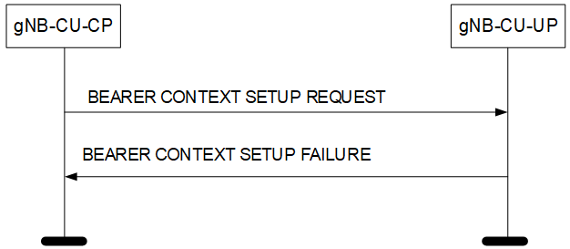
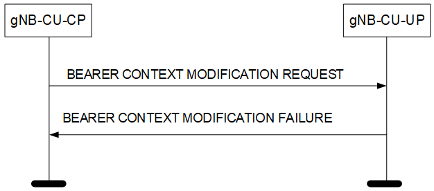

- > Title: E1 Application Protocol (E1AP)
- ### 8.3.1 Bearer Context Setup
	- #### 8.3.1.2 Successful Operation
		- TODO TBU
		- If the *[SCG Activation Status]([[SCG (de)activation|SCG (de)activation]])* IE is contained in the BEARER CONTEXT SETUP REQUEST message, the gNB-CU-UP shall take it into account when handling DL data transfer as specified in TS 37.340 [19].
	- #### 8.3.1.3 Unsuccessful Operation
		- Figure 8.3.1.3-1: Bearer Context Setup procedure: Unsuccessful Operation.
		  
		- If the gNB-CU-UP cannot establish the requested bearer context, or cannot even establish one bearer, or cannot handle [SCG with the indicated activated or deactivated status]([[SCG (de)activation|SCG (de)activation]]) it shall consider the procedure as failed and respond with a BEARER CONTEXT SETUP FAILURE message and appropriate cause value.
		- TODO TBU
- ### 8.3.2 Bearer Context Modification (gNB-CU-CP initiated)
	- #### 8.3.2.2 Successful Operation
		- TODO TBU
		- If the *[SCG Activation Status]([[SCG (de)activation|SCG (de)activation]])* IE is contained in the BEARER CONTEXT MODIFICATION REQUEST message, the gNB-CU-UP shall take it into account when handling DL data transfer as specified in TS 37.340 [19].
	- #### 8.3.2.3 Unsuccessful Operation
		- Figure 8.3.2.3-1: Bearer Context Modification procedure: Unsuccessful Operation.
		  
		- If the gNB-CU-UP cannot successfully perform any of the requested bearer context modifications, or cannot handle [SCG with the indicated activated or deactivated status]([[SCG (de)activation|SCG (de)activation]]) it shall respond with a BEARER CONTEXT MODIFICATION FAILURE message and appropriate cause value.
		- TODO TBU