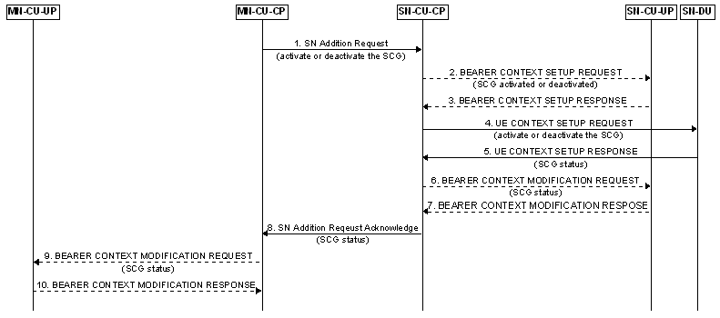
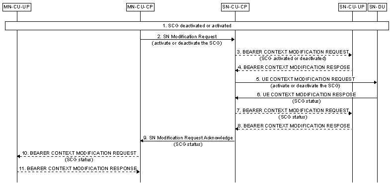
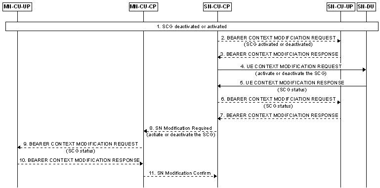

- > Title: NG-RAN; Architecture description
- ### 8.4.4 [SCG Deactivation and Activation]([[SCG (de)activation|SCG (de)activation]])
	- This clause gives the [NR SCG deactivation and activation]([[SCG (de)activation|SCG (de)activation]]) procedures in MR-DC given that the SN consists of a gNB-CU and gNB-DU(s).
	- #### 8.4.4.1 SN Addition with [SCG Activation or Deactivation]([[SCG (de)activation|SCG (de)activation]])
		- Figure 8.4.4.1-1: [SCG Activation or Deactivation]([[SCG (de)activation|SCG (de)activation]]) in SN Addition procedure
		  
		- 1. The MN sends the SN Addition Request message to the SN, indicates the request of [SCG activation or deactivation]([[SCG (de)activation|SCG (de)activation]]).
		- 2. The SN-CU-CP may send the BEARER CONTEXT SETUP REQUEST message to the SN-CU-UP to setup bearer context and notify the [activation or deactivation of the SCG]([[SCG (de)activation|SCG (de)activation]]).
		- 3. The SN-CU-UP sends the BEARER CONTEXT SETUP RESPONSE message to the SN-CU-CP.
		- 4. The SN-CU sends the UE CONTEXT SETUP REQUEST message to the SN-DU to setup UE context and indicate the request of [SCG activation or deactivation]([[SCG (de)activation|SCG (de)activation]]).
		- 5. The SN-DU sends the UE CONTEXT SETUP RESPONSE message to the SN-CU, indicates the [SCG status]([[SCG (de)activation|SCG (de)activation]]). In case [SCG activation]([[SCG (de)activation|SCG (de)activation]]) is requested, the SN-DU shall indicate [SCG activated]([[SCG (de)activation|SCG (de)activation]]) in the message.
		- 6. The SN-CU-CP may send the BEARER CONTEXT MODIFICATION REQUEST message to the SN-CU-UP as described in clause 8.9.2 and may notify the [SCG status]([[SCG (de)activation|SCG (de)activation]]) if needed.
		- 7. The SN-CU-UP sends the BEARER CONTEXT MODIFICATION RESPONSE message to the SN-CU-CP.
		- 8. The SN sends the SN Addition Request Acknowledge message to the MN, indicates the [SCG status]([[SCG (de)activation|SCG (de)activation]]). In case [SCG activation]([[SCG (de)activation|SCG (de)activation]]) is requested, the SN shall indicate [SCG activated]([[SCG (de)activation|SCG (de)activation]]) in the message.
		- 9. The MN-CU-CP may send the BEARER CONTEXT MODIFICATION REQUEST message to the MN-CU-UP to notify the [SCG status]([[SCG (de)activation|SCG (de)activation]]).
		- 10. The MN-CU-UP sends the BEARER CONTEXT MODIFICATION RESPONSE message to the MN-CU-CP.
	- #### 8.4.4.2 MN initiated SN Modification with [SCG Activation or Deactivation]([[SCG (de)activation|SCG (de)activation]])
		- Figure 8.4.4.2-1: [SCG Activation or Deactivation]([[SCG (de)activation|SCG (de)activation]]) in MN initiated SN Modification procedure
		  
		- 1. [SCG is deactivated or activated]([[SCG (de)activation|SCG (de)activation]]).
		- 2. The MN sends the SN Modification Request message to the SN, indicates the request of [SCG activation or deactivation]([[SCG (de)activation|SCG (de)activation]]).
		- 3. The SN-CU-CP may send the BEARER CONTEXT MODIFICATION REQUEST message to the SN-CU-UP to notify the [SCG activation or deactivation]([[SCG (de)activation|SCG (de)activation]]).
		- 4. The SN-CU-UP sends the BEARER CONTEXT MODIFICATION RESPONSE message to the SN-CU-CP.
		- 5. The SN-CU sends the UE CONTEXT MODIFICATION REQUEST message to the SN-DU to indicate the request of [SCG activation or deactivation]([[SCG (de)activation|SCG (de)activation]]).
		- 6. The SN-DU may send the UE CONTEXT MODIFICATION RESPONSE message to the SN-CU, indicates the [SCG status]([[SCG (de)activation|SCG (de)activation]]).
		- 7. The SN-CU-CP sends the BEARER CONTEXT MODIFICATION REQUEST message to the SN-CU-UP to notify the [SCG status]([[SCG (de)activation|SCG (de)activation]]).
		- 8. The SN-CU-UP sends the BEARER CONTEXT MODIFICATION RESPONSE message to the SN-CU-CP.
		- NOTE: Step 7 and 8 may be skipped in case the SN-DU accepted the [SCG activation or deactivation]([[SCG (de)activation|SCG (de)activation]]) request.
		- 9. The SN sends the SN Modification Request Acknowledge message towards the MN, indicates the [SCG status]([[SCG (de)activation|SCG (de)activation]]).
		- 10. The MN-CU-CP may send the BEARER CONTEXT MODIFICATION REQUEST message to the MN-CU-UP to notify the [SCG status]([[SCG (de)activation|SCG (de)activation]]).
		- 11. The MN-CU-UP sends the BEARER CONTEXT MODIFICATION RESPONSE message to the MN-CU-CP.
	- #### 8.4.4.3 SN initiated SN Modification with [SCG Activation or Deactivation]([[SCG (de)activation|SCG (de)activation]])
		- Figure 8.4.4.3-1: [SCG Activation or Deactivation]([[SCG (de)activation|SCG (de)activation]]) in SN initiated SN Modification procedure
		  
		- 1. [SCG is deactivated or activated]([[SCG (de)activation|SCG (de)activation]]).
		- 2. The SN-CU-CP may send the BEARER CONTEXT MODIFICATION REQUEST message to the SN-CU-UP to notify the [SCG activation or deactivation]([[SCG (de)activation|SCG (de)activation]]).
		- 3. The SN-CU-UP sends the BEARER CONTEXT MODIFICATION RESPONSE message to the SN-CU-CP.
		- 4. The SN-CU sends the UE CONTEXT MODIFICATION REQUEST message to the SN-DU to indicate the request of [SCG activation or deactivation]([[SCG (de)activation|SCG (de)activation]]).
		- 5. The SN-DU sends the UE CONTEXT MODIFICATION RESPONSE message to the SN-CU, indicates the [SCG status]([[SCG (de)activation|SCG (de)activation]]).
		- 6. The SN-CU-CP may send the BEARER CONTEXT MODIFICATION REQUEST message to the SN-CU-UP to notify the [SCG status]([[SCG (de)activation|SCG (de)activation]]).
		- 7. The SN-CU-UP sends the BEARER CONTEXT MODIFICATION RESPONSE message to the SN-CU-CP.
		- NOTE 1: Step 6 and 7 may be skipped in case the SN-DU accepted the [SCG activation or deactivation]([[SCG (de)activation|SCG (de)activation]]) request.
		- 8. The SN sends the SN Modification Required message to the MN, indicates the request of [SCG activation or deactivation]([[SCG (de)activation|SCG (de)activation]]).
		- 9. The MN-CU-CP may send the BEARER CONTEXT MODIFICATION REQUEST message to the MN-CU-UP to notify the [SCG status]([[SCG (de)activation|SCG (de)activation]]).
		- 10. The MN-CU-UP sends the BEARER CONTEXT MODIFICATION RESPONSE message to the MN-CU-CP.
		- NOTE 2:	Based on implementation, step 9 and 10 can be performed after step 11.
		- 11. The MN sends the SN Modification Confirm message to the SN.
		- NOTE 3: Step 8-11 are not performed in case the SN-DU rejected the [SCG activation or deactivation]([[SCG (de)activation|SCG (de)activation]]) request.