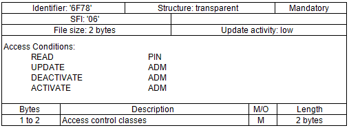
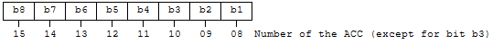
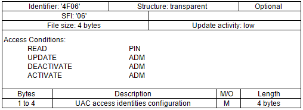
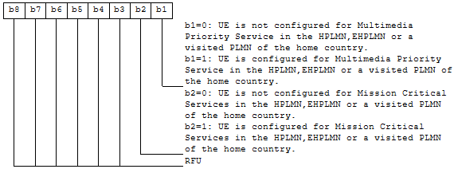

alias:: 🏷 Characteristics of the Universal Subscriber Identity Module (USIM) application
- ### 4.2.15 $EF_{ACC}$ (Access Control Class)
	- This EF contains the assigned access control class(es). The access control class is a parameter to control the access attempts. 15 classes are split into 10 classes randomly allocated to normal subscribers and 5 classes allocated to specific high priority users. For more information see TS 22.011 [2].
	- 
	- Access control classes
		- Coding
			- each ACC is coded on one bit. An ACC is "allocated" if the corresponding bit is set to 1 and "not allocated" if this bit is set to 0. Bit b3 of byte 1 is set to 0.
			- Byte 1
				- 
			- Byte 2
				- 
- ### 4.4.11 Contents o files at the $DF_{5GS}$ level
	- #### 4.4.11.7 $EF_{UAC\_AIC}$ (UAC Access Identities Configuration)
		- If service n°126 is "available" in $EF_{UST}$, this file shall be present.
		- This EF contains the configuration information pertaining to access identities allocated for specific high priority services that can be used by the subscriber. The assigned access identities are used, in combination with an access category, to control the access attempts. For more information see TS 22.261 [106] and TS 24.501 [104].
		- 
		- UAC access identities configuration
			- Contents
				- Configuration of certain Unified Access Control (UAC) access identities specified in TS 24.501 [104] clause 4.5.2.
			- Coding
				- Each access identity configuration is coded on one bit.
				- Byte 1
					- 
				- Byte 2
					- Bits b1 to b8 are RFU.
		- NOTE 1:	Access Identities 11 to 15 (as specified in TS 24.501 [104]) are configured as Access Classes 11 to 15 in EFACC, specified in clause 4.2.15.
		- NOTE 2:	The home country is defined as the country to which user subscription is associated (e.g. the MCC part of the IMSI, see the definition in TS 24.301[51]).