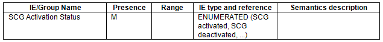
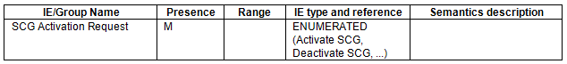

alias:: 🏷 E-UTRAN; X2AP
repository:: https://portal.3gpp.org/desktopmodules/Specifications/SpecificationDetails.aspx?specificationId=2452

- ### 8.7.4 SgNB Addition Preparation
	- #### 8.7.4.2 Successful Operation
		- (Omitted)
		- If the [SCG Activation Request IE](((648f3892-437a-4232-8c29-26f91d0b5366))) is included in the SGNB ADDITION REQUEST message, the en-gNB may use it to configure SCG resources as specified in [TS 37.340]([[3GPP/37 series/TS 37.340/10.2.1 EN-DC]]), and shall, if supported, include the [SCG Activation Status IE](((648f38b7-ff9f-4571-adcb-ec00693f85ae))) in the SGNB ADDITION REQUEST ACKNOWLEDGE message. If the [SCG Activation Request IE](((648f3892-437a-4232-8c29-26f91d0b5366))) in the SGNB ADDITION REQUEST message is set to "Activate SCG", the en-gNB shall, if supported, activate the SCG resources and set the [SCG Activation Status IE](((648f38b7-ff9f-4571-adcb-ec00693f85ae))) in the SGNB ADDITION REQUEST ACKNOWLEDGE message to "SCG activated".
		  id:: 648f37a8-afe4-4f18-bc27-2b9ce6dd4aac
		- (Omitted)
- ### 8.7.6 MeNB initiated SgNB Modification Preparation
	- #### 8.7.6.2 Successful Operation
		- (Omitted)
		- If the [SCG Activation Request IE](((648f38d8-99d0-4659-ba0d-fafe41710422))) is included in the SGNB MODIFICATION REQUEST message, the en-gNB may use it to configure SCG resources as specified in [TS 37.340]([[3GPP/37 series/TS 37.340/10.3.1 EN-DC]]), and shall, if supported, include the [SCG Activation Status IE](((648f3905-d52a-44fe-95ef-d8e8173311f5))) in the SGNB MODIFICATION REQUEST ACKNOWLEDGE message.
		- (Omitted)
- ### 8.7.7 SgNB initiated SgNB Modification
	- #### 8.7.7.2 Successful Operation
		- (Omitted)
		- If the [SCG Activation Request IE](((648f391e-fa54-4be5-b361-12b72285e513))) is included in the SGNB MODIFICATION REQUIRED message, the MeNB shall, if supported, consider that the en-gNB node is about to reconfigure the SCG resources as specified in [TS 37.340]([[3GPP/37 series/TS 37.340/10.3.1 EN-DC]]).
		- (Omitted)
- ### 9.1.4 Messages for E-UTRAN-NR Dual Connectivity Procedures
	- #### 9.1.4.1 SGNB ADDITION REQUEST
		- This message is sent by the MeNB to the en-gNB to request the preparation of resources for EN-DC operation for a specific UE
		- Direction: MeNB -> en-gNB.
		- TODO Capture the tabular form of the message
		  id:: 648f3892-437a-4232-8c29-26f91d0b5366
	- #### 9.1.4.2 SGNB ADDITION REQUEST ACKNOWLEDGE
		- This message is sent by the en-gNB to confirm the MeNB about the SgNB addition preparation.
		- Direction: en-gNB -> MeNB.
		- TODO Capture the tabular form of the message
		  id:: 648f38b7-ff9f-4571-adcb-ec00693f85ae
	- #### 9.1.4.5 SGNB MODIFICATION REQUEST
		- This message is sent by the MeNB to the en-gNB to request the preparation to modify en-gNB resources for a specific UE, to query for the current SCG configuration, or to provide the S-RLF-related information to the en-gNB.
		- Direction: MeNB -> en-gNB.
		- TODO Capture the tabular form of the message
		  id:: 648f38d8-99d0-4659-ba0d-fafe41710422
	- #### 9.1.4.6 SGNB MODIFICATION REQUEST ACKNOWLEDGE
		- This message is sent by the en-gNB to confirm the MeNB’s request to modify the en-gNB resources for a specific UE.
		- Direction: en-gNB -> MeNB.
		- TODO Capture the tabular form of the message
		  id:: 648f3905-d52a-44fe-95ef-d8e8173311f5
	- #### 9.1.4.8 SGNB MODIFICATION REQUIRED
		- This message is sent by the en-gNB to the MeNB to request the modification of en-gNB resources for a specific UE.
		- Direction: en-gNB -> MeNB.
		- TODO Capture the tabular form of the message
		  id:: 648f391e-fa54-4be5-b361-12b72285e513
- ## 9.2 Information Element definitions
	- ### 9.2.6 Cause
		- The purpose of the cause information element is to indicate the reason for a particular event for the whole protocol.
		- TODO Capture the tabular form of the message
		- The meaning of the different cause values is described in the following table. In general, "not supported" cause values indicate that the concerned capability is missing. On the other hand, "not available" cause values indicate that the concerned capability is present, but insufficient resources were available to perform the requested action.
		- Radio Network Layer Cause / Meaning
			- (Omitted)
			- [SCG activation deactivation]([[3GPP/SCG (de)activation]]) failure
				- The action failed due to rejection of the SCG activation deactivation request.
			- (Omitted)
	- ### 9.2.178 SCG Activation Status
		- The SCG Activation Status IE indicates [the status of the SCG resources]([[3GPP/SCG (de)activation]]).
		- 
	- ### 9.2.179 SCG Activation Request
		- The SCG Activation Request IE indicates whether the [SCG resources are required to be activated or deactivated]([[3GPP/SCG (de)activation]]).
		- 