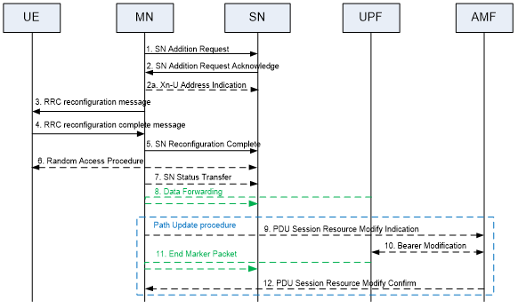
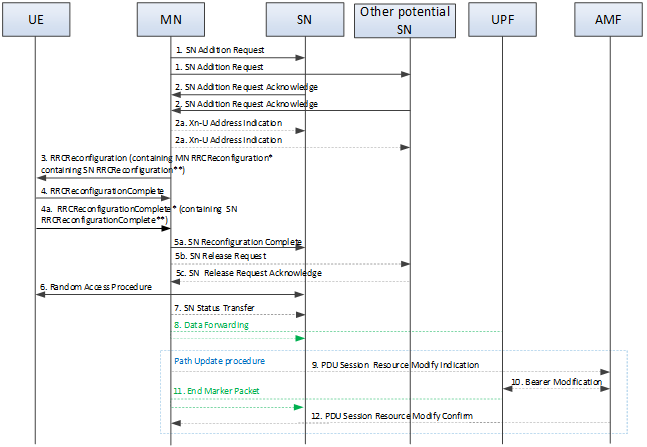

- The Secondary Node (SN) Addition procedure is initiated by the MN and is used to establish a UE context at the SN in order to provide resources from the SN to the UE. For bearers requiring SCG radio resources, this procedure is used to add at least the initial SCG serving cell of the SCG. This procedure can also be used to configure an SN terminated MCG bearer (where no SCG configuration is needed). In case of CPA, the Conditional Secondary Node Addition procedure can be used for CPA configuration and CPA execution.
- **Secondary Node Addition**
	- Figure 10.2.2-1 shows the SN Addition procedure.
	- 
	  Figure 10.2.2-1: SN Addition procedure
	- 1.	The MN decides to request the target SN to allocate resources for one or more specific PDU Sessions/QoS Flows, indicating QoS Flows characteristics (QoS Flow Level QoS parameters, PDU session level TNL address information, and PDU session level Network Slice info). In addition, for bearers requiring SCG radio resources, MN indicates the requested SCG configuration information, including the entire UE capabilities and the UE capability coordination result. In this case, the MN also provides the latest measurement results for SN to choose and configure the SCG cell(s). The MN may request the SN to allocate radio resources for split SRB operation. In NGEN-DC and NR-DC, the MN always provides all the needed security information to the SN (even if no SN terminated bearers are setup) to enable SRB3 to be setup based on SN decision. The MN may request the [SCG to be activated or deactivated]([[3GPP/SCG (de)activation]]).
	  	For MN terminated bearer options that require Xn-U resources between the MN and the SN, the MN provides Xn-U UL TNL address information. For SN terminated bearers, the MN provides a list of available DRB IDs. The S-NG-RAN node shall store this information and use it when establishing SN terminated bearers. The SN may reject the request.
	  	For SN terminated bearer options that require Xn-U resources between the MN and the SN, the MN provides in step 1 a list of QoS flows per PDU Sessions for which SCG resources are requested to be setup upon which the SN decides how to map QoS flows to DRB.
		- NOTE 1:	For split bearers, MCG and SCG resources may be requested of such an amount, that the QoS for the respective QoS Flow is guaranteed by the exact sum of resources provided by the MCG and the SCG together, or even more. For MN terminated split bearers, the MN decision is reflected in step 1 by the QoS Flow parameters signalled to the SN, which may differ from QoS Flow parameters received over NG.
		- NOTE 2:	For a specific QoS flow, the MN may request the direct establishment of SCG and/or split bearers, i.e. without first having to establish MCG bearers. It is also allowed that all QoS flows can be mapped to SN terminated bearers, i.e. there is no QoS flow mapped to an MN terminated bearer.
	- 2.	If the RRM entity in the SN is able to admit the resource request, it allocates respective radio resources and, dependent on the bearer type options, respective transport network resources. For bearers requiring SCG radio resources the SN triggers UE Random Access so that synchronisation of the SN radio resource configuration can be performed. The SN decides for the PSCell and other SCG SCells and provides the new SCG radio resource configuration to the MN within an SN RRC configuration message contained in the SN Addition Request Acknowledge message. If the MN requested the [SCG to be deactivated]([[3GPP/SCG (de)activation]]), the SN may keep the SCG activated. If the MN requests the SCG to be activated, the SN shall keep the SCG activated. In case of bearer options that require Xn-U resources between the MN and the SN, the SN provides Xn-U TNL address information for the respective DRB, Xn-U UL TNL address information for SN terminated bearers, Xn-U DL TNL address information for MN terminated bearers. For SN terminated bearers, the SN provides the NG-U DL TNL address information for the respective PDU Session and security algorithm. If SCG radio resources have been requested, the SCG radio resource configuration is provided.
		- NOTE 3:	In case of MN terminated bearers, transmission of user plane data may take place after step 2.
		- NOTE 4:	In case of SN terminated bearers, data forwarding and the SN Status Transfer may take place after step 2.
		- NOTE 5:	For MN terminated bearers for which PDCP duplication with CA is configured in NR SCG side, the MN allocates up to 4 separate Xn-U bearers and the SN provides a logical channel ID for primary or split secondary path to the MN.
		  	For SN terminated bearers for which PDCP duplication with CA is configured in NR MCG side, the SN allocates up to 4 separate Xn-U bearers and the MN provides a logical channel ID for primary or split secondary path to the SN via an additional MN-initiated SN modification procedure.
	- 2a.	For SN terminated bearers using MCG resources, the MN provides Xn-U DL TNL address information in the Xn-U Address Indication message.
	- 3.	The MN sends the MN RRC reconfiguration message to the UE including the SN RRC configuration message, without modifying it. Within the MN RRC reconfiguration message, the MN can indicate the [SCG is deactivated]([[3GPP/SCG (de)activation]]).
	- 4.	The UE applies the new configuration and replies to MN with MN RRC reconfiguration complete message, including an SN RRC response message for SN, if needed. In case the UE is unable to comply with (part of) the configuration included in the MN RRC reconfiguration message, it performs the reconfiguration failure procedure.
	- 5.	The MN informs the SN that the UE has completed the reconfiguration procedure successfully via SN Reconfiguration Complete message, including the SN RRC response message, if received from the UE.
	- 6.	If configured with bearers requiring SCG radio resources and the [SCG is not deactivated]([[3GPP/SCG (de)activation]]), the UE performs synchronisation towards the PSCell configured by the SN. The order the UE sends the MN RRC reconfiguration complete message and performs the Random Access procedure towards the SCG is not defined. The successful RA procedure towards the SCG is not required for a successful completion of the RRC Connection Reconfiguration procedure.
	- 7.	If PDCP termination point is changed to the SN for bearers using RLC AM, and when RRC full configuration is not used, the MN sends the SN Status Transfer message.
	- 8.	For SN terminated bearers or QoS flows moved from the MN, dependent on the characteristics of the respective bearer or QoS flow, the MN may take actions to minimise service interruption due to activation of MR-DC (Data forwarding).
	- 9-12.	If applicable, the update of the UP path towards the 5GC is performed via a PDU Session Path Update procedure.
- **Conditional Secondary Node Addition**
	- Figure 10.2.2-2 shows the Conditional SN Addition procedure.
	- 
	  Figure 10.2.2-2: Conditional Secondary Node Addition procedure
	- 1.	The MN decides to configure CPA for the UE. The MN requests the candidate SN(s) to allocate resources for one or more specific PDU Sessions/QoS Flows, indicating QoS Flows characteristics (QoS Flow Level QoS parameters, PDU session level TNL address information, and PDU session level Network Slice info), indicating that the request is for CPA and providing the upper limit for the number of PSCells that can be prepared by the candidate SN. In addition, for bearers requiring SCG radio resources, the MN indicates the requested SCG configuration information, including the entire UE capabilities and the UE capability coordination result. In this case, the MN also provides the candidate cells recommended by MN via the latest measurement results for the candidate SN to choose and configure the SCG cell(s). The MN may request the candidate SN to allocate radio resources for split SRB operation. In NR-DC, the MN always provides all the needed security information to the candidate SN (even if no SN terminated bearers are setup) to enable SRB3 to be setup based on SN decision.
	  	For MN terminated bearer options that require Xn-U resources between the MN and the candidate SN, the MN provides Xn-U UL TNL address information. For SN terminated bearers, the MN provides a list of available DRB IDs. The candidate SN shall store this information and use it when establishing SN terminated bearers. The candidate SN may reject the addition request.
	  	For SN terminated bearer options that require Xn-U resources between the MN and the candidate SN, the MN provides in step 1 a list of QoS flows per PDU Sessions for which SCG resources are requested to be setup upon which the candidate SN decides how to map QoS flows to DRB.
		- NOTE 6:	For split bearers, MCG and SCG resources may be requested of such an amount, that the QoS for the respective QoS Flow is guaranteed by the exact sum of resources provided by the MCG and the SCG together, or even more. For MN terminated split bearers, the MN decision is reflected in step 1 by the QoS Flow parameters signalled to the candidate SN, which may differ from QoS Flow parameters received over NG.
		- NOTE 7:	For a specific QoS flow, the MN may request the direct establishment of SCG and/or split bearers, i.e. without first having to establish MCG bearers. It is also allowed that all QoS flows can be mapped to SN terminated bearers, i.e. there is no QoS flow mapped to an MN terminated bearer.
	- 2.	If the RRM entity in the candidate SN is able to admit the resource request, it allocates respective radio resources and, dependent on the bearer type options, respective transport network resources, and provides the prepared PSCell ID(s) to the MN. For bearers requiring SCG radio resources the candidate SN configures Random Access so that synchronisation of the SN radio resource configuration can be performed at the CPA execution. Fromthe list of cells indicated within the measurement results provided by the MN, the candidate SN decides the list of PSCell(s) to prepare (considering the maximum number indicated by the MN) and, for each prepared PSCell, the candidate SN decides other SCG SCells and provides the new corresponding SCG radio resource configuration to the MN in an NR RRCReconfiguration** message, contained in the SN Addition Request Acknowledge message. The candidate SN can either accept or reject each of the candidate cells listed within the measurement results indicated by the MN, i.e. it cannot configure any alternative candidates. In case of bearer options that require Xn-U resources between the MN and the candidate SN, the candidate SN provides Xn-U TNL address information for the respective DRB, Xn-U UL TNL address information for SN terminated bearers, Xn-U DL TNL address information for MN terminated bearers. For SN terminated bearers, the candidate SN provides the NG-U DL TNL address information for the respective PDU Session and security algorithm. If SCG radio resources have been requested, the SCG radio resource configuration is provided.
		- NOTE 8:	For MN terminated bearers for which PDCP duplication with CA is configured in NR SCG side, the MN allocates up to 4 separate Xn-U bearers and the candidate SN provides a logical channel ID for primary or split secondary path to the MN.
		  	For SN terminated bearers for which PDCP duplication with CA is configured in NR MCG side, the candidate SN allocates up to 4 separate Xn-U bearers and the MN provides a logical channel ID for primary or split secondary path to the candidate SN via an additional MN-initiated SN modification procedure.
		- NOTE 9:	In case of SN terminated bearers, early data forwarding may take place after step 2. For the early data forwarding of SN terminated bearers, the MN forwards the PDCP SDU to the candidate SN. For the early transmission of MN terminated split/SCG bearers, the MN forwards the PDCP PDU to the candidate SN.
	- 2a.	For SN terminated bearers using MCG resources, the MN provides Xn-U DL TNL address information in the Xn-U Address Indication message. In case of early data forwarding in CPA, the MN sends the Early Status Transfer message to the candidate SN.
	- 3.	The MN sends to the UE an RRCReconfiguration message including the CPA configuration, i.e. a list of RRCReconfiguration* messages and associated execution conditions. Each RRCReconfiguration* message contains the SCG configuration in the RRCReconfiguration** received from the candidate SN in step 2 and possibly an MCG configuration. Besides, the RRCReconfiguration message can also include an updated MCG configuration. e.g. to configure the required conditional measurements.
	- 4.	The UE applies the RRCReconfiguration message received in step 3, stores the CPA configuration and replies to the MN with an RRCReconfigurationComplete message. In case the UE is unable to comply with (part of) the configuration included in the RRCReconfiguration message, it performs the reconfiguration failure procedure.
	- 4a.	The UE starts evaluating the execution conditions. If the execution condition of one candidate PSCell is satisfied, the UE applies RRCReconfiguration* message corresponding to the selected candidate PSCell, and sends an MN RRCReconfigurationComplete* message, including an RRCReconfigurationComplete** message for the selected candidate PSCell, and information enabling the MN to identify the SN of the selected candidate PSCell.
	- 5a-5c.	The MN informs the SN of the selected candidate PSCell that the UE has completed the reconfiguration procedure successfully via SN Reconfiguration Complete message, including the RRCReconfigurationComplete** message. The MN sends the SN Release Request message(s) to cancel CPA in the other candidate SN(s), if configured. The other candidate SN(s) acknowledges the release request.
	- 6.	The UE performs synchronisation towards the PSCell indicated in the RRCReconfiguration* message applied in step 4a. The order the UE sends the MN RRCReconfigurationComplete* message and performs the Random Access procedure towards the SCG is not defined. The successful RA procedure towards the SCG is not required for a successful completion of the RRC Connection Reconfiguration procedure.
	- 7.	If PDCP termination point is changed to the SN for bearers using RLC AM, and when RRC full configuration is not used, the MN sends the SN Status Transfer message.
	- 8.	For SN terminated bearers or QoS flows moved from the MN, dependent on the characteristics of the respective bearer or QoS flow, the MN may take actions to minimise service interruption due to activation of MR-DC (Data forwarding).
	- 9-12.	If applicable, the update of the UP path towards the 5GC is performed via a PDU Session Path Update procedure.