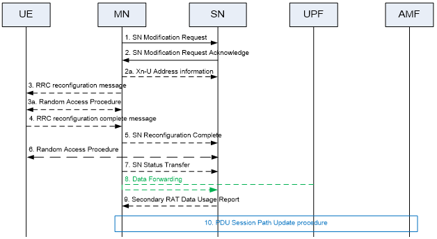
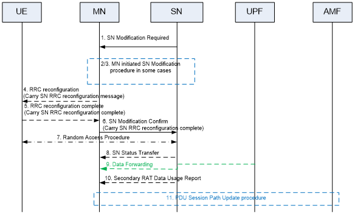
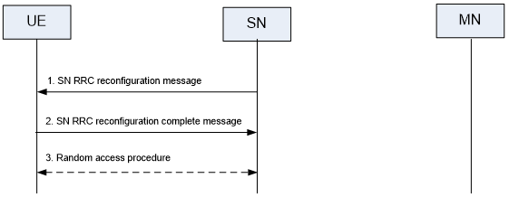
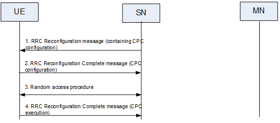
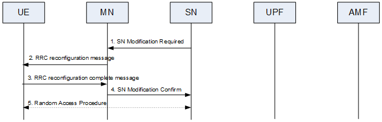
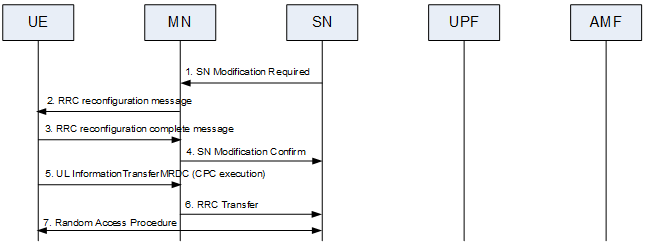

- The SN Modification procedure may be initiated either by the MN or by the SN and be used to modify the current user plane resource configuration (e.g. related to PDU session, QoS flow or DRB) or to modify other properties of the UE context within the same SN. It may also be used to transfer an RRC message from the SN to the UE via the MN and the response from the UE via MN to the SN (e.g. when SRB3 is not used). In NGEN-DC and NR-DC, the RRC message is an NR message (i.e., RRCReconfiguration) whereas in NE-DC it is an E-UTRA message (i.e., RRCConnectionReconfiguration). In case of CPA or inter-SN CPC, this procedure is used to modify CPA or inter-SN CPC configuration within the same candidate SN. In case of CPA or inter-SN CPC, this procedure may also be triggered by the candidate SN to add some prepared PSCells from the suggested list or cancel part of the prepared PSCells. In case of intra-SN CPC, this procedure is used to configure, modify or release intra-SN CPC configuration. This procedure may be initiated by the MN or SN to request the SN or MN to [activate or deactivate the SCG]([[3GPP/SCG (de)activation]]).
- The SN modification procedure does not necessarily need to involve signalling towards the UE.
- **MN initiated SN Modification**
	- 
	  Figure 10.3.2-1: SN Modification procedure - MN initiated
	- The MN uses the procedure to initiate configuration changes of the SCG within the same SN, including addition, modification or release of the user plane resource configuration. The MN uses this procedure to perform handover within the same MN while keeping the SN, when the SN needs to be involved (i.e. in NGEN-DC). The MN also uses the procedure to query the current SCG configuration, e.g. when delta configuration is applied in an MN initiated SN change. The MN also uses the procedure to provide the S-RLF related information to the SN or to provide additional available DRB IDs to be used for SN terminated bearers. The MN also uses this procedure to [activate or deactivate the SCG]([[3GPP/SCG (de)activation]]). The MN may not use the procedure to initiate the addition, modification or release of SCG SCells. The SN may reject the request, except if it concerns the release of the user plane resource configuration, or if it is used to perform handover within the same MN while keeping the SN. Figure 10.3.2-1 shows an example signalling flow for an MN initiated SN Modification procedure.
	- 1.	The MN sends the SN Modification Request message, which may contain user plane resource configuration related or other UE context related information, PDU session level Network Slice info and the requested SCG configuration information, including the UE capabilities coordination result to be used as basis for the reconfiguration by the SN. In case a security key update in the SN is required, a new SN Security Key is included. In case the PDCP data recovery in the SN is required, the PDCP Change Indication is included which indicates that PDCP data recovery is required in SN.
	- 2.	The SN responds with the SN Modification Request Acknowledge message, which may contain new SCG radio configuration information within an SN RRC reconfiguration message, and data forwarding address information (if applicable). If the MN requested the [SCG to be activated or deactivated]([[3GPP/SCG (de)activation]]), the SN indicates whether the SCG is activated or deactivated.
		- NOTE 1:	For MN terminated bearers to be setup for which PDCP duplication with CA is configured in NR SCG side, the MN allocates up to 4 separate Xn-U bearers and the SN provides a logical channel ID for primary or split secondary path to the MN.
		  	For SN terminated bearers to be setup for which PDCP duplication with CA is configured in NR MCG side, the SN allocates up to 4 separate Xn-U bearers and the MN provides a logical channel ID for primary or split secondary path to the SN via an additional MN-initiated SN modification procedure.
	- 2a.	When applicable, the MN provides data forwarding address information to the SN. For SN terminated bearers using MCG resources, the MN provides Xn-U DL TNL address information in the Xn-U Address Indication message.
	- 3/4.	The MN initiates the RRC reconfiguration procedure, including an SN RRC reconfiguration message. The UE applies the new configuration, synchronizes to the MN (if instructed, in case of intra-MN handover) and replies with MN RRC reconfiguration complete message, including an SN RRC response message, if needed. In case the UE is unable to comply with (part of) the configuration included in the MN RRC reconfiguration message, it performs the reconfiguration failure procedure.
	- 5.	Upon successful completion of the reconfiguration, the success of the procedure is indicated in the SN Reconfiguration Complete message.
	- 6.	If instructed, the UE performs synchronisation towards the PSCell of the SN as described in SN addition procedure. Otherwise, the UE may perform UL transmission after having applied the new configuration.
	- 7.	If PDCP termination point is changed for bearers using RLC AM, and when RRC full configuration is not used, the SN Status Transfer takes place between the MN and the SN (Figure 10.3.2-1 depicts the case where a bearer context is transferred from the MN to the SN).
	- 8.	If applicable, data forwarding between MN and the SN takes place (Figure 10.3.2-1 depicts the case where a user plane resource configuration related context is transferred from the MN to the SN).
	- 9.	The SN sends the Secondary RAT Data Usage Report message to the MN and includes the data volumes delivered to and received from the UE as described in clause 10.11.2.
		- NOTE 2:	The order the SN sends the Secondary RAT Data Usage Report message and performs data forwarding with MN is not defined. The SN may send the report when the transmission of the related QoS flow is stopped.
	- 10.	If applicable, a PDU Session path update procedure is performed.
- **SN initiated SN Modification with MN involvement**
	- 
	  Figure 10.3.2-2: SN Modification procedure - SN initiated with MN involvement
	- The SN uses the procedure to perform configuration changes of the SCG within the same SN, e.g. to trigger the modification/release of the user plane resource configuration, to trigger the release of SCG resources (e.g., release SCG lower layer resources but keep SN), and to trigger PSCell changes (e.g. when a new security key is required or when the MN needs to perform PDCP data recovery). The MN cannot reject the release request of PDU session/QoS flows and the release request of SCG resources. The SN also uses the procedure to request the MN to provide more DRB IDs to be used for SN terminated bearers or to return DRB IDs used for SN terminated bearers that are not needed any longer. The SN also uses this procedure to [activate or deactivate the SCG]([[3GPP/SCG (de)activation]]). Figure 10.3.2-2 shows an example signalling flow for SN initiated SN Modification procedure.
	- 1.	The SN sends the SN Modification Required message including an SN RRC reconfiguration message, which may contain user plane resource configuration related context, other UE context related information and the new radio resource configuration of SCG. The SN may request the [SCG to be activated or deactivated]([[3GPP/SCG (de)activation]]). In case of change of security key, the PDCP Change Indication indicates that an SN security key update is required. In case the MN needs to perform PDCP data recovery, the PDCP Change Indication indicates that PDCP data recovery is required.
	  	The SN can decide whether the change of security key is required.
		- NOTE 3a:	In case that a MN initiated conditional reconfiguration (e.g. CHO or MN initiated inter-SN CPC) is prepared, and if any execution of a prepared SN initiated intra-SN CPC procedure or reconfiguration of the SCG, the SN notifies to the MN via the SN Modification Required message. In this case, the steps 2 and 3 are skipped.
		- NOTE 3b:	In case of SN initiated inter-SN CPC and in case that a candidate SN triggered the SN Initiated SN Modification procedure to include some prepared PSCells (within the candidate cells suggested by the source SN in SN initiated inter-SN CPC) or to remove some prepared PSCells, the MN may decide to trigger the step 2 towards the source SN.
	- 2/3.	The MN initiated SN Modification procedure may be triggered by SN Modification Required message, e.g. when an SN security key change needs to be applied.
		- NOTE 3:	For SN terminated bearers to be setup for which PDCP duplication with CA is configured in NR MCG side, the SN allocates up to 4 separate Xn-U bearers and the MN provides a logical channel ID for primary or split secondary path to the SN via the nested MN-initiated SN modification procedure.
	- 4.	The MN sends the MN RRC reconfiguration message to the UE including the SN RRC reconfiguration message with the new SCG radio resource configuration.
	- 5.	The UE applies the new configuration and sends the MN RRC reconfiguration complete message, including an SN RRC response message, if needed. In case the UE is unable to comply with (part of) the configuration included in the MN RRC reconfiguration message, it performs the reconfiguration failure procedure.
	- 6.	Upon successful completion of the reconfiguration, the success of the procedure is indicated in the SN Modification Confirm message including the SN RRC response message, if received from the UE.
	- 7.	If instructed, the UE performs synchronisation towards the PSCell configured by the SN as described in SN Addition procedure. Otherwise, the UE may perform UL transmission directly after having applied the new configuration.
	- 8.	If PDCP termination point is changed for bearers using RLC AM, and when RRC full configuration is not used, the SN Status Transfer takes place between the MN and the SN (Figure 10.3.2-2 depicts the case where a bearer context is transferred from the SN to the MN).
	- 9.	If applicable, data forwarding between MN and the SN takes place (Figure 10.3.2-2 depicts the case where a user plane resource configuration related context is transferred from the SN to the MN).
	- 10.	The SN sends the Secondary RAT Data Usage Report message to the MN and includes the data volumes delivered to and received from the UE as described in clause 10.11.2.
		- NOTE 4:	The order the SN sends the Secondary RAT Data Usage Report message and performs data forwarding with MN is not defined. The SN may send the report when the transmission of the related QoS flow is stopped.
	- 11.	If applicable, a PDU Session path update procedure is performed.
- **SN initiated SN Modification without MN involvement**
	- This procedure is not supported for NE-DC.
	- 
	  Figure 10.3.2-3: SN Modification - SN initiated without MN involvement
	- The SN initiated SN modification procedure without MN involvement is used to modify the configuration within SN in case no coordination with MN is required, including the addition/modification/release of SCG SCell and PSCell change (e.g. when the security key does not need to be changed and the MN does not need to be involved in PDCP recovery). The SN may initiate the procedure to configure, modify or release intra-SN CPC configuration within the same SN. Figure 10.3.2-3 shows an example signalling flow for SN initiated SN modification procedure without MN involvement. The SN can decide whether the Random Access procedure is required.
	- 1.	The SN sends the SN RRC reconfiguration message to the UE through SRB3.
	- 2.	The UE applies the new configuration and replies with the SN RRC reconfiguration complete message. In case the UE is unable to comply with (part of) the configuration included in the SN RRC reconfiguration message, it performs the reconfiguration failure procedure.
	- 3.	If instructed, the UE performs synchronisation towards the PSCell of the SN as described in SN Addition procedure. Otherwise the UE may perform UL transmission after having applied the new configuration.
- **SN initiated Conditional SN Modification without MN involvement (SRB3 is used)**
	- This procedure is not supported for NE-DC and NGEN-DC.
	- 
	  Figure 10.3.2-3a: SN Modification – SN-initiated without MN involvement and SRB3 is used to configure intra-SN CPC.
	- The SN initiates the procedure when it needs to transfer an NR RRC message to the UE and SRB3 is used to configure intra-SN CPC.
	- 1.	The SN sends the SN RRC reconfiguration including CPC configuration to the UE through SRB3.
	- 2.	The UE applies the new configuration. In case the UE is unable to comply with (part of) the configuration included in the SN RRC reconfiguration message, it performs the reconfiguration failure procedure. The UE starts evaluating the CPC execution conditions for the candidate PSCell(s). The UE maintains connection with the source PSCell and replies with the RRCReconfigurationComplete message to the SN via SRB3.
	- 3.	If at least one CPC candidate PSCell satisfies the corresponding CPC execution condition, the UE detaches from the source PSCell, applies the stored configuration corresponding to the selected candidate PSCell and synchronises to the candidate PSCell.
	- 4.	The UE completes the CPC execution procedure by sending an RRCReconfigurationComplete message to the new PSCell.
- **Transfer of an NR RRC message to/from the UE (when SRB3 is not used)**
	- This procedure is supported for all the MR-DC options.
	- 
	  Figure 10.3.2-4: Transfer of an NR RRC message to/from the UE
	- The SN initiates the procedure when it needs to transfer an NR RRC message to the UE and SRB3 is not used.
	- 1.	The SN initiates the procedure by sending the SN Modification Required to the MN including the SN RRC reconfiguration message.
	- 2.	The MN forwards the SN RRC reconfiguration message to the UE including it in the RRC reconfiguration message.
	- 3.	The UE applies the new configuration and replies with the RRC reconfiguration complete message by including the SN RRC reconfiguration complete message. In case the UE is unable to comply with (part of) the configuration included in the SN RRC reconfiguration message, it performs the reconfiguration failure procedure.
	- 4.	The MN forwards the SN RRC response message, if received from the UE, to the SN by including it in the SN Modification Confirm message.
	- 5.	If instructed, the UE performs synchronisation towards the PSCell of the SN as described in SN Addition procedure. Otherwise the UE may perform UL transmission after having applied the new configuration.
- **SN initiated Conditional SN Modification without MN involvement (SRB3 is not used)**
	- This procedure is not supported for NE-DC and NGEN-DC.
	- 
	  Figure 10.3.2-5: SN Modification - SN-initiated without MN involvement and SRB3 is not used to configure intra-SN CPC
	- The SN initiates the procedure when it needs to transfer an NR RRC message to the UE and SRB3 is not used to configure intra-SN CPC.
	- 1.	The SN initiates the procedure by sending the SN Modification Required to the MN including the SN RRC reconfiguration message with CPC configuration.
	- 2.	The MN forwards the SN RRC reconfiguration message to the UE including it in the RRCReconfiguration message.
	- 3.	The UE replies with the RRCReconfigurationComplete message by including the SN RRC reconfiguration complete message. In case the UE is unable to comply with (part of) the configuration included in the SN RRC reconfiguration message, it performs the reconfiguration failure procedure. The UE maintains connection with source PSCell after receiving CPC configuration, and starts evaluating the CPC execution conditions for the candidate PSCell(s).
	- 4.	The MN forwards the SN RRC response message, if received from the UE, to the SN by including it in the SN Modification Confirm message.
	- 5.	If at least one CPC candidate PSCell satisfies the corresponding CPC execution condition, the UE completes the CPC execution procedure by an ULInformationTransferMRDC message to the MN which includes an embedded RRCReconfigurationComplete message to the selected target PSCell.
	- 6.	The RRCReconfigurationComplete message is forwarded to the SN embedded in RRC Transfer message.
	- 7.	The UE detaches from the source PSCell, applies the stored corresponding configuration and synchronises to the selected candidate PSCell.