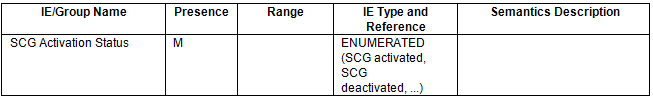

alias:: 🏷 NG-RAN; E1 application protocol (E1AP)
repository:: https://portal.3gpp.org/desktopmodules/Specifications/SpecificationDetails.aspx?specificationId=3957

- ### 8.3.1 Bearer Context Setup Request
	- #### 8.3.1.2 Successful Operation
		- (Omitted)
		- If the [SCG Activation Status](((649db2fd-3e78-4d81-8fb1-306be5dc6ba8))) IE is contained in the BEARER CONTEXT SETUP REQUEST message, the gNB-CU-UP shall take it into account when handling DL data transfer as specified in TS 37.340 [19].
	- #### 8.3.1.3 Unsuccessful Operation
		- (Omitted)
		- If the gNB-CU-UP cannot establish the requested bearer context, or cannot even establish one bearer, or cannot handle [SCG with the indicated activated or deactivated]([[3GPP/NR/SCG (de)activation]]) status it shall consider the procedure as failed and respond with a BEARER CONTEXT SETUP FAILURE message and appropriate cause value.
- ### 8.3.2. Bearer Context Modification (gNB-CU-CP initiated)
	- #### 8.3.2.2 Successful Operation
		- (Omitted)
		- If the [SCG Activation Status](((649db2fd-3e78-4d81-8fb1-306be5dc6ba8))) IE is contained in the BEARER CONTEXT MODIFICATION REQUEST message, the gNB-CU-UP shall take it into account when handling DL data transfer as specified in TS 37.340 [19].
		- (Omitted)
	- #### 8.3.2.3 Unsuccessful Operation
		- (Omitted)
		- If the gNB-CU-UP cannot successfully perform any of the requested bearer context modifications, or cannot handle [SCG with the indicated activated or deactivated]([[3GPP/NR/SCG (de)activation]]) status, it shall respond with a BEARER CONTEXT MODIFICATION FAILURE message and appropriate cause value.
		- (Omitted)
- ### 9.2.2 Bearer Context Management messages
	- #### 9.2.2.1 BEARER CONTEXT SETUP REQUEST
		- This message is sent by the gNB-CU-CP to request the gNB-CU-UP to setup a bearer context.
		- Direction: gNB-CU-CP -> gNB-CU-UP
		- TODO Capture message in tabular form
	- #### 9.2.2.4 BEARER CONTEXT MODIFICATION REQUEST
		- This message is sent by the gNB-CU-CP to request the gNB-CU-UP to modify a bearer context. 
		  Direction: gNB-CU-CP -> gNB-CU-UP
		- TODO Capture message in tabular form
- ### 9.3.1 Radio Network Layer Related IEs
	- #### 9.3.1.2 Cause
		- The purpose of the *Cause* IE is to indicate the reason for a
		  particular event for the E1AP protocol.
		- (Omitted)
	- #### 9.3.1.105 [SCG Activation]([[3GPP/NR/SCG (de)activation]]) Status
	  id:: 649db2fd-3e78-4d81-8fb1-306be5dc6ba8
		- The SCG Activation Status IE indicates the status of SCG resources.
		- 