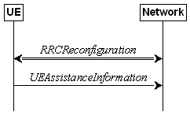

alias:: 🏷 NR RRC protocol specification
repository:: https://portal.3gpp.org/desktopmodules/Specifications/SpecificationDetails.aspx?specificationId=3197

- ### 5.3.5 RRC reconfiguration
	- #### 5.3.5.3 Reception of an RRCReconfiguration by the UE
		- (Omitted)
		- 1>	if the UE is configured with E-UTRA nr-SecondaryCellGroupConfig (UE in (NG)EN-DC):
			- 2>	if the RRCReconfiguration message was received via E-UTRA SRB1 as specified in TS 36.331 [10]; or
			- 2>	if the RRCReconfiguration message was received via E-UTRA RRC message RRCConnectionReconfiguration within MobilityFromNRCommand (handover from NR standalone to (NG)EN-DC);
				- (Omitted)
				- 3>	if the [scg-State](((648eff70-610a-4b5c-a08f-31c0be7672b9))) is not included in the E-UTRA message (RRCConnectionReconfiguration or RRCConnectionResume) containing the RRCReconfiguration message:
					- 4>	perform [SCG activation]([[3GPP/SCG (de)activation]]) as specified in [5.3.5.13a](((648ef4c8-12ce-4d8f-9022-c0097c73c912)));
					- 4>	if reconfigurationWithSync was included in spCellConfig of an SCG:
						- 5>	initiate the Random Access procedure on the PSCell, as specified in TS 38.321 [3];
					- 4>	else if the [SCG was deactivated]([[3GPP/SCG (de)activation]]) before the reception of the E-UTRA RRC message containing the RRCReconfiguration message:
						- 5>	if bfd-and-RLM was not configured to true before the reception of the E-UTRA RRCConnectionReconfiguration or RRCConnectionResume message containing the RRCReconfiguration message or if lower layers indicate that a Random Access procedure is needed for [SCG activation]([[3GPP/SCG (de)activation]]):
							- 6>	initiate the Random Access procedure on the SpCell, as specified in TS 38.321 [3];
						- 5>	else the procedure ends;
					- 4>	else the procedure ends;
				- 3>	else:
					- 4>	perform [SCG deactivation]([[3GPP/SCG (de)activation]]) as specified in [5.3.5.13b](((648ef58e-93b8-44a2-a32c-2acf2e1a83d4)));
					- 4>	the procedure ends;
			- 2>	if the RRCReconfiguration message was received within nr-SecondaryCellGroupConfig in RRCConnectionReconfiguration message received via SRB3 within DLInformationTransferMRDC:
				- 3>	submit the RRCReconfigurationComplete via E-UTRA embedded in E-UTRA RRC message RRCConnectionReconfigurationComplete as specified in TS 36.331 [10], clause 5.3.5.3/5.3.5.4;
				- 3>	if the [scg-State](((648eff70-610a-4b5c-a08f-31c0be7672b9))) is not included in the RRCConnectionReconfiguration:
					- 4>	if reconfigurationWithSync was included in spCellConfig of an SCG:
						- 5>	initiate the Random Access procedure on the SpCell, as specified in TS 38.321 [3];
					- 4>	else the procedure ends;
				- 3>	else:
					- 4>	perform [SCG deactivation]([[3GPP/SCG (de)activation]]) as specified in [5.3.5.13b](((648ef58e-93b8-44a2-a32c-2acf2e1a83d4)));
					- 4>	the procedure ends;
			- NOTE 1:	The order the UE sends the RRCConnectionReconfigurationComplete message and performs the Random Access procedure towards the SCG is left to UE implementation.
			- (Omitted)
		- 1>	else if the RRCReconfiguration message was received via SRB1 within the nr-SCG within mrdc-SecondaryCellGroup (UE in NR-DC, mrdc-SecondaryCellGroup was received in RRCReconfiguration or RRCResume via SRB1):
			- 2>	if the RRCReconfiguration is applied due to a conditional reconfiguration execution for CPC which is configured via conditionalReconfiguration contained in nr-SCG within mrdc-SecondaryCellGroup:
				- 3>	submit the RRCReconfigurationComplete message via the NR MCG embedded in NR RRC message ULInformationTransferMRDC as specified in clause 5.7.2a.3.
			- 2>	if the [scg-State](((648efffd-2d95-45be-a424-19d273bc88be))) is not included in the RRCReconfiguration or RRCResume message containing the RRCReconfiguration message:
				- 3>	perform [SCG activation]([[3GPP/SCG (de)activation]]) as specified in [5.3.5.13a](((648ef4c8-12ce-4d8f-9022-c0097c73c912)));
				- 3>	if reconfigurationWithSync was included in spCellConfig in nr-SCG:
					- 4>	initiate the Random Access procedure on the PSCell, as specified in TS 38.321 [3];
				- 3>	else if the [SCG was deactivated]([[3GPP/SCG (de)activation]]) before the reception of the NR RRC message containing the RRCReconfiguration message:
					- 4>	if bfd-and-RLM was not configured to true before the reception of the RRCReconfiguration or RRCResume message containing the RRCReconfiguration message; or
					- 4>	if lower layers indicate that a Random Access procedure is needed for [SCG activation]([[3GPP/SCG (de)activation]]):
						- 5>	initiate the Random Access procedure on the PSCell, as specified in TS 38.321 [3];
					- 4>	else the procedure ends;
				- 3>	else the procedure ends;
			- 2>	else
				- 3>	perform [SCG deactivation]([[3GPP/SCG (de)activation]]) as specified in [5.3.5.13b](((648ef58e-93b8-44a2-a32c-2acf2e1a83d4)));
				- 3>	the procedure ends;
			- NOTE 2a:	The order in which the UE sends the RRCReconfigurationComplete message and performs the Random Access procedure towards the SCG is left to UE implementation.
		- 1>	else if the RRCReconfiguration message was received via SRB3 (UE in NR-DC):
			- 2>	if the RRCReconfiguration message was received within DLInformationTransferMRDC:
				- 3>	if the RRCReconfiguration message was received within the nr-SCG within mrdc-SecondaryCellGroup (NR SCG RRC Reconfiguration):
					- 4>	if the [scg-State](((648eff70-610a-4b5c-a08f-31c0be7672b9))) is not included in the RRCReconfiguration message containing the RRCReconfiguration message:
						- 5>	if reconfigurationWithSync was included in spCellConfig in nr-SCG:
							- 6>	initiate the Random Access procedure on the PSCell, as specified in TS 38.321 [3];
						- 5>	else:
							- 6>	the procedure ends;
					- 4>	else:
						- 5>	perform [SCG deactivation]([[3GPP/SCG (de)activation]]) as specified in [5.3.5.13b](((648ef58e-93b8-44a2-a32c-2acf2e1a83d4)));
						- 5>	the procedure ends;
				- 3>	else:
					- 4>	if the RRCReconfiguration does not include the mrdc-SecondaryCellGroupConfig:
						- 5>	if the RRCReconfiguration includes the [scg-State](((648eff70-610a-4b5c-a08f-31c0be7672b9))):
							- 6>	perform [SCG deactivation]([[3GPP/SCG (de)activation]]) as specified in [5.3.5.13b](((648ef58e-93b8-44a2-a32c-2acf2e1a83d4)));
					- 4>	submit the RRCReconfigurationComplete message via SRB1 to lower layers for transmission using the new configuration;
			- 2>	else:
				- 3>	submit the RRCReconfigurationComplete message via SRB3 to lower layers for transmission using the new configuration;
		- 1>	else (RRCReconfiguration was received via SRB1):
			- 2>	if the UE is in NR-DC and;
			- 2>	if the RRCReconfiguration does not include the mrdc-SecondaryCellGroupConfig:
				- 3>	if the RRCReconfiguration includes the [scg-State](((648eff70-610a-4b5c-a08f-31c0be7672b9))):
					- 4>	perform [SCG deactivation]([[3GPP/SCG (de)activation]]) as specified in [5.3.5.13b](((648ef58e-93b8-44a2-a32c-2acf2e1a83d4)));
				- 3>	else:
					- 4>	perform [SCG activation]([[3GPP/SCG (de)activation]]) without SN message as specified in [5.3.5.13b1](((648ef610-dc49-448f-aaf2-bad36a382691)));
			- (Omitted)
		- (Omitted)
	- #### 5.3.5.5 Cell Group configuration
		- ##### 5.3.5.5.1 General
			- The network configures the UE with Master Cell Group (MCG), and zero or one Secondary Cell Group (SCG). In (NG)EN-DC, the MCG is configured as specified in TS 36.331 [10], and for NE-DC, the SCG is configured as specified in TS 36.331 [10]. The network provides the configuration parameters for a cell group in the CellGroupConfig IE.
			  The UE performs the following actions based on a received CellGroupConfig IE:
				- 1>	if the CellGroupConfig contains the spCellConfig with reconfigurationWithSync:
					- 2>	perform Reconfiguration with sync according to 5.3.5.5.2;
					- 2>	resume all suspended radio bearers except the SRBs for the source cell group, and resume SCG transmission for all radio bearers, and resume BH RLC channels and resume SCG transmission for BH RLC channels for IAB-MT, if suspended;
						- NOTE:	If the [SCG is deactivated]([[3GPP/SCG (de)activation]]), resuming SCG transmission for all radio bearers does not imply that PDCP PDUs can be transmitted or received on SCG RLC bearers.
				- (Omitted)
	- #### 5.3.5.9 Other configuration
		- The UE shall:
			- (Omitted)
			- 1>	if the received otherConfig includes the [scg-DeactivationPreferenceConfig](((648f1a37-b194-44ea-9e24-74e66195bba8))):
				- 2>	if the scg-DeactivationPreferenceConfig is set to setup:
					- 3>	consider itself to be configured to provide its [SCG deactivation]([[3GPP/SCG (de)activation]]) preference in accordance with [5.7.4](((648f1687-a96d-4ad7-84c9-39aeb306f3b5)));
				- 2>	else:
					- 3>	consider itself not to be configured to provide its [SCG deactivation]([[3GPP/SCG (de)activation]]) preference and stop timer ((648f1a6e-2797-42dd-b486-c67effd1960e)) , if running.
			- (Omitted)
	- #### 5.3.5.13a [SCG activation]([[3GPP/SCG (de)activation]])
	  id:: 648ef4c8-12ce-4d8f-9022-c0097c73c912
		- Upon initiating the procedure, the UE shall:
			- 1>	if the UE is configured with an SCG after receiving the message for which this procedure is initiated:
				- 2>	if the UE was configured with a deactivated SCG before receiving the message for which this procedure is initiated:
					- 3>	consider the SCG to be activated;
					- 3>	resume performing radio link monitoring on the SCG, if previously stopped;
					- 3>	indicate to lower layers to resume beam failure detection on the PSCell, if previously stopped;
					- 3>	indicate to lower layers that the SCG is activated.
	- #### 5.3.5.13b [SCG deactivation]([[3GPP/SCG (de)activation]])
	  id:: 648ef58e-93b8-44a2-a32c-2acf2e1a83d4
		- Upon initiating the procedure, the UE shall:
			- 1>	consider the SCG to be deactivated;
			- 1>	indicate to lower layers that the SCG is deactivated;
			- 1>	if bfd-and-RLM is configured to true:
				- 2>	perform radio link monitoring on the SCG;
				- 2>	indicate to lower layers to perform beam failure detection on the PSCell;
			- 1>	else:
				- 2>	stop radio link monitoring on the SCG;
				- 2>	indicate to lower layers to stop beam failure detection on the PSCell;
				- 2>	stop timer T310 for this cell group, if running;
				- 2>	stop timer T312 for this cell group, if running;
				- 2>	reset the counters N310 and N311;
			- 1>	if the UE was in RRC_CONNECTED and the SCG was activated before receiving the message for which this procedure is initiated:
				- 2>	if SRB3 was configured before the reception of the RRCReconfiguration or of the RRCConnectionReconfiguration and SRB3 is not to be released according to any RadioBearerConfig included in the RRCReconfiguration or in the RRCConnectionReconfiguration as specified in TS 36.331[10]:
					- 3>	trigger the PDCP entity of SRB3 to perform SDU discard as specified in TS 38.323 [5];
					- 3>	re-establish the RLC entity of SRB3 as specified in TS 38.322 [4].
	- #### 5.3.5.13b1 [SCG activation]([[3GPP/SCG (de)activation]]) without SN message
	  id:: 648ef610-dc49-448f-aaf2-bad36a382691
		- Upon initiating the procedure, the UE shall:
			- 1>	if the SCG was deactivated before the reception of the RRCReconfiguration message or the E-UTRA RRCConnectionReconfiguration message for which the procedure invoking this clause is executed:
				- 2>	consider the SCG to be activated;
				- 2>	indicate to lower layers that the SCG is activated;
				- 2>	resume performing radio link monitoring on the SCG, if previously stopped;
				- 2>	indicate to lower layers to resume beam failure detection on the PSCell, if previously stopped;
				- 2>	if bfd-and-RLM was not configured to true before the reception of the RRCReconfiguration message or the E-UTRA RRCConnectionReconfiguration message for which the procedure invoking this clause is executed; or
				- 2>	if lower layers indicate that a Random Access procedure is needed for SCG activation:
					- 3>	initiate the Random Access procedure on the PSCell, as specified in TS 38.321 [3].
- ### 5.3.7 RRC connection re-establishment
	- #### 5.3.7.2 Initiation
		- (Omitted)
		- Upon initiation of the procedure, the UE shall:
			- (Omitted)
			- 1>	if UE is not configured with attemptCondReconfig:
				- (Omitted)
				- 2>	release [scg-DeactivationPreferenceConfig](((648f1a37-b194-44ea-9e24-74e66195bba8))), if configured, and stop timer ((648f1a6e-2797-42dd-b486-c67effd1960e)) , if running;
				- (Omitted)
			- (Omitted)
		- (Omitted)
	- #### 5.3.7.3. Actions following cell selection while T311 is running
		- Upon selecting a suitable NR cell, the UE shall:
			- (Omitted)
			- 1>	else:
				- 2>	if UE is configured with attemptCondReconfig:
					- (Omitted)
					- 3>	release [scg-DeactivationPreferenceConfig](((648f1a37-b194-44ea-9e24-74e66195bba8))), if configured, and stop timer ((648f1a6e-2797-42dd-b486-c67effd1960e)) , if running;
					- (Omitted)
				- (Omitted)
			- (Omitted)
- ### 5.7.4 UE Assistance Information
  id:: 648f1687-a96d-4ad7-84c9-39aeb306f3b5
	- #### 5.7.4.1 General
		- 
		  Figure 5.7.4.1-1: UE Assistance Information
		- The purpose of this procedure is for the UE to inform the network of:
			- (Omitted)
			- its preference for the [SCG to be deactivated]([[3GPP/SCG (de)activation]]), or;
			- (Omitted)
	- #### 5.7.4.2 Initiation
	  id:: 648f1690-ebf6-4d8e-9f5b-413168398635
		- (Omitted)
		- A UE capable of providing its preference for [SCG deactivation]([[3GPP/SCG (de)activation]]) may initiate the procedure if it was configured to do so, upon determining that it prefers or does no more prefer the SCG to be deactivated.
		- (Omitted)
		- Upon initiating the procedure, the UE shall:
			- (Omitted)
			- 1>	if configured to provide its preference for [SCG deactivation]([[3GPP/SCG (de)activation]]) and timer ((648f1a6e-2797-42dd-b486-c67effd1960e)) is not running;
				- 2>	if the UE prefers the [SCG to be deactivated]([[3GPP/SCG (de)activation]]) and did not transmit a UEAssistanceInformation message with [scg-DeactivationPreference](((648f19c8-d53c-4b0c-af6d-05860ce469b5))) since it was configured to provide its SCG deactivation preference; or
				- 2>	if the UE preference for [SCG deactivation]([[3GPP/SCG (de)activation]]) is different from the last indicated [scg-DeactivationPreference](((648f19c8-d53c-4b0c-af6d-05860ce469b5))):
					- 3>	start timer ((648f1a6e-2797-42dd-b486-c67effd1960e)) with the timer value set to the [scg-DeactivationPreferenceProhibitTimer](((648f1a1c-798f-4a50-af09-a15ad630bd5d)));
					- 3>	initiate transmission of the UEAssistanceInformation message in accordance with [5.7.4.3](((648f169a-bb6d-4a29-81f0-676ac02494ef))) to provide the UE preference for [SCG deactivation]([[3GPP/SCG (de)activation]]);
			- 1>	if the [SCG is deactivated]([[3GPP/SCG (de)activation]]), and,
			- 1>	the UE has uplink data to send for an SCG RLC entity while the UE previously did not have any uplink data to send for any SCG RLC entity:
				- 2>	initiate transmission of the UEAssistanceInformation message in accordance with [5.7.4.3](((648f169a-bb6d-4a29-81f0-676ac02494ef))) to indicate that the UE has uplink data to send for a DRB whose DRB-Identity is not included in any RLC-BearerConfig in the CellGroupConfig associated with the MCG.
			- (Omitted)
	- #### 5.7.4.3 Actions related to transmission of UEAssistanceInformation message
	  id:: 648f169a-bb6d-4a29-81f0-676ac02494ef
		- The UE shall set the contents of the UEAssistanceInformation message as follows:
			- (Omitted)
			- 1>	if transmission of the UEAssistanceInformation message is initiated to provide an indication of preference for [SCG deactivation]([[3GPP/SCG (de)activation]]) according to [5.7.4.2](((648f1690-ebf6-4d8e-9f5b-413168398635))):
				- 2>	include [scg-DeactivationPreference](((648f19c8-d53c-4b0c-af6d-05860ce469b5))) in the UEAssistanceInformation message;
				- 2>	set the [scg-DeactivationPreference](((648f19c8-d53c-4b0c-af6d-05860ce469b5))) to scgDeactivationPreferred if the UE prefers the SCG to be deactivated, otherwise set it to noPreference;
			- 1>	if transmission of the UEAssistanceInformation message is initiated to provide an indication that the UE has uplink data related to a deactivated SCG according to [5.7.4.2](((648f1690-ebf6-4d8e-9f5b-413168398635))):
				- 2>	include uplinkData in the UEAssistanceInformation message.
			- (Omitted)
		- (Omitted)
- ### 6.2.2 Message definitions
	- #### RRCReconfiguration
		- ```
		  RRCReconfiguration-v1700-IEs ::=        SEQUENCE {
		      otherConfig-v1700                       OtherConfig-v1700                                              OPTIONAL, -- Need M
		      sl-L2RelayUE-Config-r17                 SetupRelease { SL-L2RelayUE-Config-r17 }                       OPTIONAL, -- Need M
		      sl-L2RemoteUE-Config-r17                SetupRelease { SL-L2RemoteUE-Config-r17 }                      OPTIONAL, -- Need M
		      dedicatedPagingDelivery-r17             OCTET STRING (CONTAINING Paging)                               OPTIONAL, -- Cond PagingRelay
		      needForGapNCSG-ConfigNR-r17             SetupRelease {NeedForGapNCSG-ConfigNR-r17}                     OPTIONAL, -- Need M
		      needForGapNCSG-ConfigEUTRA-r17          SetupRelease {NeedForGapNCSG-ConfigEUTRA-r17}                  OPTIONAL, -- Need M
		      musim-GapConfig-r17                     SetupRelease {MUSIM-GapConfig-r17}                             OPTIONAL, -- Need M
		      ul-GapFR2-Config-r17                    SetupRelease { UL-GapFR2-Config-r17 }                          OPTIONAL, -- Need M
		      scg-State-r17                           ENUMERATED { deactivated }                                     OPTIONAL, -- Need N
		      appLayerMeasConfig-r17                  AppLayerMeasConfig-r17                                         OPTIONAL, -- Need M
		      ue-TxTEG-RequestUL-TDOA-Config-r17      SetupRelease {UE-TxTEG-RequestUL-TDOA-Config-r17}              OPTIONAL,  -- Need M
		      nonCriticalExtension                    SEQUENCE {}                                                    OPTIONAL
		  }
		  ```
		- **scg-State**
		  id:: 648eff70-610a-4b5c-a08f-31c0be7672b9
			- Indicates that the [SCG is in deactivated state]([[3GPP/SCG (de)activation]]).
			- This field is not used
				- in an RRCReconfiguration message received:
					- within mrdc-SecondaryCellGroup, or
					- in an E-UTRA RRCConnectionReconfiguration message, or
					- in an E-UTRA RRCConnectionResume message or
				- in an RRCReconfiguration message received via SRB3, except if the RRCReconfiguration message is included in DLInformationTransferMRDC.
			- The field is absent if CPA or CPC is configured for the UE, or if the RRCReconfiguration message is contained in CondRRCReconfig.
	- #### RRCResume
	  id:: 648eff66-a169-42f9-8615-a6fc3233ed81
		- ```
		  RRCResume-v1700-IEs ::=             SEQUENCE {
		      sl-ConfigDedicatedNR-r17            SetupRelease {SL-ConfigDedicatedNR-r16}                         OPTIONAL, -- Cond L2RemoteUE
		      sl-L2RemoteUE-Config-r17            SetupRelease {SL-L2RemoteUE-Config-r17}                         OPTIONAL, -- Cond L2RemoteUE
		      needForGapNCSG-ConfigNR-r17         SetupRelease {NeedForGapNCSG-ConfigNR-r17}                      OPTIONAL, -- Need M
		      needForGapNCSG-ConfigEUTRA-r17      SetupRelease {NeedForGapNCSG-ConfigEUTRA-r17}                   OPTIONAL, -- Need M
		      scg-State-r17                       ENUMERATED {deactivated}                                        OPTIONAL, -- Need N
		      appLayerMeasConfig-r17              AppLayerMeasConfig-r17                                          OPTIONAL, -- Need M
		      nonCriticalExtension                SEQUENCE {}                                                     OPTIONAL
		  }
		  ```
		- **scg-State**
		  id:: 648efffd-2d95-45be-a424-19d273bc88be
			- Indicates that the [SCG is in deactivated state]([[3GPP/SCG (de)activation]]).
	- #### UEAssistanceInformation
		- id:: 648f19c8-d53c-4b0c-af6d-05860ce469b5
		  ```
		  UEAssistanceInformation-v1700-IEs ::= SEQUENCE {
		      ul-GapFR2-Preference-r17              UL-GapFR2-Preference-r17              OPTIONAL,
		      musim-Assistance-r17                  MUSIM-Assistance-r17                  OPTIONAL,
		      overheatingAssistance-r17             OverheatingAssistance-r17             OPTIONAL,
		      maxBW-PreferenceFR2-2-r17             MaxBW-PreferenceFR2-2-r17             OPTIONAL,
		      maxMIMO-LayerPreferenceFR2-2-r17      MaxMIMO-LayerPreferenceFR2-2-r17      OPTIONAL,
		      minSchedulingOffsetPreferenceExt-r17  MinSchedulingOffsetPreferenceExt-r17  OPTIONAL,
		      rlm-MeasRelaxationState-r17           BOOLEAN                               OPTIONAL,
		      bfd-MeasRelaxationState-r17           BIT STRING (SIZE (1..maxNrofServingCells)) OPTIONAL,
		      nonSDT-DataIndication-r17             SEQUENCE {
		          resumeCause-r17                       ResumeCause                       OPTIONAL
		      }                                                                           OPTIONAL,
		      scg-DeactivationPreference-r17        ENUMERATED { scgDeactivationPreferred, noPreference }    OPTIONAL,
		      uplinkData-r17                        ENUMERATED { true }                   OPTIONAL,
		      rrm-MeasRelaxationFulfilment-r17      BOOLEAN                               OPTIONAL,
		      propagationDelayDifference-r17        PropagationDelayDifference-r17        OPTIONAL,
		      nonCriticalExtension                  SEQUENCE {}                           OPTIONAL
		  }
		  ```
- ### 6.3.4 Other information elements
	- #### OtherConfig
		- id:: 648f1a1c-798f-4a50-af09-a15ad630bd5d
		  ```
		  OtherConfig-v1700 ::=                   SEQUENCE {
		      ul-GapFR2-PreferenceConfig-r17          ENUMERATED {true}                                             OPTIONAL, -- Need R
		      musim-GapAssistanceConfig-r17           SetupRelease {MUSIM-GapAssistanceConfig-r17}                  OPTIONAL, -- Need M
		      musim-LeaveAssistanceConfig-r17         SetupRelease {MUSIM-LeaveAssistanceConfig-r17}                OPTIONAL, -- Need M
		      successHO-Config-r17                    SetupRelease {SuccessHO-Config-r17}                           OPTIONAL, -- Need M
		      maxBW-PreferenceConfigFR2-2-r17         ENUMERATED {true}                                             OPTIONAL, -- Cond maxBW
		      maxMIMO-LayerPreferenceConfigFR2-2-r17  ENUMERATED {true}                                             OPTIONAL, -- Cond maxMIMO
		      minSchedulingOffsetPreferenceConfigExt-r17  ENUMERATED {true}                                         OPTIONAL, -- Cond minOffset
		      rlm-RelaxationReportingConfig-r17       SetupRelease {RLM-RelaxationReportingConfig-r17}              OPTIONAL, -- Need M
		      bfd-RelaxationReportingConfig-r17       SetupRelease {BFD-RelaxationReportingConfig-r17}              OPTIONAL, -- Need M
		      scg-DeactivationPreferenceConfig-r17    SetupRelease {SCG-DeactivationPreferenceConfig-r17}           OPTIONAL, -- Cond SCG
		      rrm-MeasRelaxationReportingConfig-r17   SetupRelease {RRM-MeasRelaxationReportingConfig-r17}          OPTIONAL, -- Need M
		      propDelayDiffReportConfig-r17           SetupRelease {PropDelayDiffReportConfig-r17}                  OPTIONAL  -- Need M
		  }
		  
		  -- Omitted
		  
		  SCG-DeactivationPreferenceConfig-r17 ::=       SEQUENCE {
		      scg-DeactivationPreferenceProhibitTimer-r17    ENUMERATED {
		                                                     s0, s1, s2, s4, s8, s10, s15, s30,
		                                                     s60, s120, s180, s240, s300, s600, s900, s1800}
		  }
		  ```
		- **scg-DeactivationPreferenceConfig**
		  id:: 648f1a37-b194-44ea-9e24-74e66195bba8
			- Configuration of the UE to indicate its preference for [SCG deactivation]([[3GPP/SCG (de)activation]]).
- ### 7.1.1 Timers (Informative)
	- T346i
	  id:: 648f1a6e-2797-42dd-b486-c67effd1960e
		- Start
			- Upon transmitting UEAssistanceInformation message with [scg-DeactivationPreference](((648f19c8-d53c-4b0c-af6d-05860ce469b5)))
		- Stop
			- Upon releasing [scg-DeactivationPreferenceConfig](((648f1a37-b194-44ea-9e24-74e66195bba8))) during RRC connection re-establishment/resume or upon receiving [scg-DeactivationPreferenceConfig](((648f1a37-b194-44ea-9e24-74e66195bba8))) set to release.
		- At expiry
			- No action