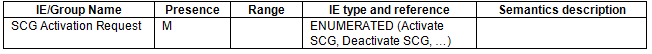
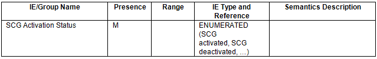

alias:: 🏷 NG-RAN; XnAP
repository:: https://portal.3gpp.org/desktopmodules/Specifications/SpecificationDetails.aspx?specificationId=3228

- ### 8.3.1 S-NG-RAN node Addition Preparation
	- #### 8.3.1.2 Successful Operation
		- (Omitted)
		- If the [SCG Activation Request IE](((648f329f-d031-4a6b-af2e-44b7e46cfccb))) is included in the S-NODE ADDITION REQUEST message, the S-NG-RAN node may use it to configure SCG resources as specified in [TS 37.340]([[3GPP/37 series/TS 37.340/10.2.2 MR-DC with 5GC]]), and shall, if supported, include the [SCG Activation Status IE](((648f3405-bcb6-43b1-880d-3a800b265009))) in the S-NODE ADDITION REQUEST ACKNOWLEDGE message. If the [SCG Activation Request IE](((648f329f-d031-4a6b-af2e-44b7e46cfccb))) in the S-NODE ADDITION REQUEST message is set to "Activate SCG", the S-NG-RAN node shall, if supported, activate the SCG resources and set the [SCG Activation Status IE](((648f3405-bcb6-43b1-880d-3a800b265009))) in the S-NODE ADDITION REQUEST ACKNOWLEDGE message to "SCG activated".
		- (Omitted)
- ### 8.3.3 M-NG-RAN node initiated S-NG-RAN node Modification Preparation
	- #### 8.3.3.2 Successful Operation
		- (Omitted)
		- If the [SCG Activation Request IE](((648f3445-4700-4a94-88c9-c21e2f497e88))) is included in the S-NODE MODIFICATION REQUEST message, the S-NG-RAN node may use it to configure SCG resources as specified in [TS 37.340]([[3GPP/37 series/TS 37.340/10.3.2 MR-DC with 5GC]]), and shall, if supported, include the [SCG Activation Status IE](((648f3250-2fc6-4616-9402-f60159ab35ff))) in the S-NODE MODIFICATION REQUEST ACKNOWLEDGE message.
		- (Omitted)
- ### 8.3.4 S-NG-RAN node initiated S-NG-RAN node Modification
	- #### 8.3.4.2 Successful Operation
		- (Omitted)
		- If the [SCG Activation Request IE](((648f346a-a2da-4dee-93f5-869293a8b9cf))) is included in the S-NODE MODIFICATION REQUIRED message, the M-NG-RAN node shall consider that the S-NG-RAN node is about to reconfigure the SCG resources as specified in [TS 37.340]([[3GPP/37 series/TS 37.340/10.3.2 MR-DC with 5GC]]).
		- (Omitted)
- ### 9.1.2 Messages for Dual Connectivity Procedures
	- #### 9.1.2.1 S-NODE ADDITION REQUEST
		- This message is sent by the M-NG-RAN node to the S-NG-RAN node to request the preparation of resources for dual connectivity operation for a specific UE.
		- Direction: M-NG-RAN node -> S-NG-RAN node.
		- TODO Capture the tabular form of the message
		  id:: 648f329f-d031-4a6b-af2e-44b7e46cfccb
	- #### 9.1.2.2 S-NODE ADDITION REQUEST ACKNOWLEDGE
		- This message is sent by the S-NG-RAN node to confirm the M-NG-RAN node about the S-NG-RAN node addition preparation.
		- Direction: S-NG-RAN node -> M-NG-RAN node.
		- TODO Capture the tabular form of the message
		  id:: 648f3405-bcb6-43b1-880d-3a800b265009
	- #### 9.1.2.5 S-NODE MODIFICATION REQUEST
		- This message is sent by the M-NG-RAN node to the S-NG-RAN node to either request the preparation to modify S-NG-RAN node resources for a specific UE, or to query for the current SCG configuration, or to provide the S-RLF-related information to the S-NG-RAN node.
		- Direction: M-NG-RAN node -> S-NG-RAN node.
		- TODO Capture the tabular form of the message
		  id:: 648f3445-4700-4a94-88c9-c21e2f497e88
	- #### 9.1.2.6 S-NODE MODIFICATION REQUEST ACKNOWLEDGE
	  id:: 648f3250-2fc6-4616-9402-f60159ab35ff
		- This message is sent by the S-NG-RAN node to confirm the M-NG-RAN node’s request to modify the S-NG-RAN node resources for a specific UE.
		- Direction: S-NG-RAN node -> M-NG-RAN node.
		- TODO Capture the tabular form of the message
	- #### 9.1.2.8 S-NODE MODIFICATION REQUIRED
		- This message is sent by the S-NG-RAN node to the M-NG-RAN node to request the modification of S-NG-RAN node resources for a specific UE.
		- Direction: S-NG-RAN node -> M-NG-RAN node.
		- TODO Capture the tabular form of the message
		  id:: 648f346a-a2da-4dee-93f5-869293a8b9cf
- ### 9.2.3 General IE definitions
	- #### 9.2.3.2 Cause
		- The purpose of the Cause IE is to indicate the reason for a particular event for the XnAP protocol.
		- TODO Capture the tabular form of the message
		- The meaning of the different cause values is specified in the following table. In general, "not supported" cause values indicate that the related capability is missing. On the other hand, "not available" cause values indicate that the related capability is present, but insufficient resources were available to perform the requested action.
		- Radio Network Layer Cause / Meaning
			- (Omitted)
			- [SCG activation deactivation]([[3GPP/SCG (de)activation]]) failure
				- The action failed due to rejection of the SCG activation deactivation request.
			- (Omitted)
		- (Omitted)
	- #### 9.2.3.154 SCG Activation Request
		- This IE indicates whether the [SCG resources are required to be activated or deactivated]([[3GPP/SCG (de)activation]]).
		- 
	- #### 9.2.3.155 SCG Activation Status
		- This IE indicates [the status of the SCG resources]([[3GPP/SCG (de)activation]]).
		- 