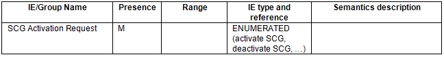
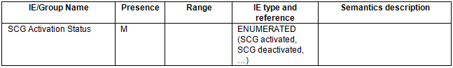

alias:: 🏷 NG-RNA; F1 application protocol (F1AP)
repository:: https://portal.3gpp.org/desktopmodules/Specifications/SpecificationDetails.aspx?specificationId=3957

- ### 8.3.1 UE Context Setup
	- #### 8.3.1.2 Successful Operation
		- (Omitted)
		- If the [SCG Activation Request](((649daf83-25ed-446b-9dc7-f775d53f1fc1))) IE is included in the UE CONTEXT SETUP REQUEST message, the gNB-DU may use it to [configure SCG resources]([[3GPP/NR/SCG (de)activation]]) as specified in TS 37.340 [7] , and if supported, shall include the [SCG Activation Status](((649dafbd-2f3e-458f-bab6-6a0244fe0b09))) IE in the UE CONTEXT SETUP RESPONSE message. If the [SCG Activation Request](((649daf83-25ed-446b-9dc7-f775d53f1fc1))) IE in the UE CONTEXT SETUP REQUEST message is set to “Activate SCG”, the gNB-DU shall activate the SCG resources and set the [SCG Activation Status](((649dafbd-2f3e-458f-bab6-6a0244fe0b09))) IE in the UE CONTEXT SETUP RESPONSE message to “SCG Activated”.
		- (Omitted)
- ### 8.3.4 UE Context Modification (gNB-CU initiated)
	- #### 8.3.4.2 Successful Operation
		- (Omitted)
		- If the [SCG Activation Request](((649daf83-25ed-446b-9dc7-f775d53f1fc1))) IE is included in the UE CONTEXT MODIFICATION REQUEST message, the gNB-DU may use it to [configure SCG resources]([[3GPP/NR/SCG (de)activation]]) as specified in TS 37.340 [7] , and if supported, shall include the [SCG Activation Status](((649dafbd-2f3e-458f-bab6-6a0244fe0b09))) IE in the UE CONTEXT MODIFICATION RESPONSE message.
		- (Omitted)
- ### 9.2.2 UE Context Management messages
	- #### 9.2.2.1 UE CONTEXT SETUP REQUEST
		- This message is sent by the gNB-CU to request the setup of a UE context.
		- Direction: gNB-CU -> gNB-DU.
		- TODO Capture message in tabular form
	- #### 9.2.2.2 UE CONTEXT SETUP RESPONSE
		- This message is sent by the gNB-DU to confirm the setup of a UE context.
		- Direction: gNB-DU -> gNB-CU.
		- TODO Capture message in tabular form
	- #### 9.2.2.7 UE CONTEXT MODIFICATION REQUEST
		- This message is sent by the gNB-CU to provide UE Context information changes to the gNB-DU.
		- Direction: gNB-CU -> gNB-DU
		- TODO Capture message in tabular form
	- #### 9.2.2.8 UE CONTEXT MODIFICATION RESPONSE
		- This message is sent by the gNB-DU to confirm the modification of a UE context.
		- Direction: gNB-DU -> gNB-CU.
		- TODO Capture message in tabular form
- ### 9.3.1 Radio Network Layer Related IEs
	- #### 9.3.1.2 Cause
		- The purpose of the Cause IE is to indicate the reason for a particular event for the F1AP protocol.
		- (Omitted)
	- #### 9.3.1.233 [SCG Activation]([[3GPP/NR/SCG (de)activation]]) Request
	  id:: 649daf83-25ed-446b-9dc7-f775d53f1fc1
		- This IE indicates whether the SCG resources are required to be activated or deactivated.
		- 
	- #### 9.3.1.234 [SCG Activation]([[3GPP/NR/SCG (de)activation]]) Status
	  id:: 649dafbd-2f3e-458f-bab6-6a0244fe0b09
		- This IE indicates the status of SCG resources.
		- 